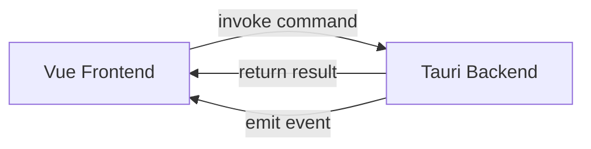

# API Specification - Tauri Commands

> [!NOTE]
> Complete API specification untuk komunikasi Frontend (Vue 3) ↔ Backend (Rust) menggunakan Tauri command system.

---

## 1. API Overview

**Communication Pattern:** JSON-RPC over Tauri IPC (Inter-ProcessCommunication)



---

## 2. Authentication & Session Commands

### 2.1 Create Session

**Command:** `create_session`

```typescript
// Frontend
interface CreateSessionRequest {
  eventId: number;
  participantId: string;
  metadata?: {
    device: string;
    os: string;
    [key: string]: any;
  };
}

interface CreateSessionResponse {
  sessionId: number;
  status: 'pending' | 'active';
  testSequence: Tool[];
}

const response = await invoke<CreateSessionResponse>('create_session', {
  eventId: 1,
  participantId: '123456',
  metadata: { device: 'Desktop', os: 'Windows 11' }
});
```

```rust
// Backend
#[tauri::command]
async fn create_session(
    event_id: i64,
    participant_id: String,
    metadata: Option<serde_json::Value>,
    state: State<'_, AppState>,
) -> Result<CreateSessionResponse, String> {
    // Implementation
}
```

**Returns:** `Result<CreateSessionResponse, String>`

**Errors:**
- `"Event not found"` - eventId tidak valid
- `"Participant ID required"` - participantId kosong
- `"Database error: {msg}"` - Database failure

---

### 2.2 Initialize Security

**Command:** `initialize_security`

```typescript
interface SecurityInitRequest {
  sessionId: number;
}

interface SecurityInitResponse {
  cameraReady: boolean;
  lockdownActive: boolean;
  faceBaseline: string; // Base64 face embedding
}

const security = await invoke<SecurityInitResponse>('initialize_security', {
  sessionId: 1
});
```

```rust
#[tauri::command]
async fn initialize_security(
    session_id: i64,
    state: State<'_, AppState>,
) -> Result<SecurityInitResponse, String>
```

**Errors:**
- `"Camera permission denied"` -Camera access ditolak
- `"No face detected"` - Tidak ada wajah terdeteksi
- `"Multiple faces detected"` - Lebih dari 1 wajah

---

## 3. Test Execution Commands

### 3.1 Load Test Package

**Command** `load_test_package`

```typescript
interface TestPackage {
  packageId: number;
  toolId: number;
  toolName: string;
  toolType: 'choice' | 'pair' | 'speed' | 'projective' | 'leadership';
  subtests: Subtest[];
  config: Record<string, any>;
}

interface Subtest {
  id: number;
  name: string;
  timeLimitSeconds: number | null;
  instructions: {
    title: string;
    text: string;
    examples?: string[];
  };
  questionCount: number;
}

const package = await invoke<TestPackage>('load_test_package', {
  sessionId: 1,
  packageId: 5
});
```

---

### 3.2 Start Subtest

**Command:** `start_subtest`

```typescript
interface StartSubtestRequest {
  sessionId: number;
  subtestId: number;
}

interface StartSubtestResponse {
  questions: Question[];
  answerKey?: string; // Only for practice mode
  startTime: string; // ISO 8601
  endTime: string | null; // null if untimed
}

interface Question {
  id: number;
  questionText: string;
  questionType: 'multiple_choice' | 'true_false' | 'pair' | 'text' | 'drawing';
  options?: string[];
  mediaUrl?: string;
  sequenceOrder: number;
}

const subtest = await invoke<StartSubtestResponse>('start_subtest', {
  sessionId: 1,
  subtestId: 10
});
```

```rust
#[tauri::command]
async fn start_subtest(
    session_id: i64,
    subtest_id: i64,
    state: State<'_, AppState>,
) -> Result<StartSubtestResponse, String>
```

---

### 3.3 Submit Responses

**Command:** `submit_responses`

```typescript
interface SubmitResponsesRequest {
  sessionId: number;
  toolId: number;
  subtestId: number;
  responses: ResponseData[];
}

interface ResponseData {
  questionId: number;
  answer: string | number | string[]; // Depends on question type
  timeSpent?: number; // seconds
}

interface SubmitResponsesResponse {
  saved: boolean;
  responseIds: number[];
  nextSubtest?: number | null;
}

await invoke<SubmitResponsesResponse>('submit_responses', {
  sessionId: 1,
  toolId: 2,
  subtestId: 10,
  responses: [
    { questionId: 1, answer: 'B', timeSpent: 12.5 },
    { questionId: 2, answer: 'A', timeSpent: 8.2 }
  ]
});
```

```rust
#[tauri::command]
async fn submit_responses(
    session_id: i64,
    tool_id: i64,
    subtest_id: i64,
    responses: Vec<ResponseData>,
    state: State<'_, AppState>,
) -> Result<SubmitResponsesResponse, String>
```

**Process:**
1. Validate session status
2. Serialize responses to JSON
3. Encrypt using AES-256-GCM
4. Save to database dengan nonce
5. Return success + next subtest ID

---

### 3.4 Complete Session

**Command:** `complete_session`

```typescript
interface CompleteSessionRequest {
  sessionId: number;
}

interface CompleteSessionResponse {
  sessionId: number;
  status: 'completed';
  completedAt: string;
  totalViolations: number;
}

const result = await invoke<CompleteSessionResponse>('complete_session', {
  sessionId: 1
});
```

```rust
#[tauri::command]
async fn complete_session(
    session_id: i64,
    state: State<'_, AppState>,
) -> Result<CompleteSessionResponse, String>
```

**Actions:**
1. Update session status → 'completed'
2. Stop surveillance worker
3. Calculate final scores
4. Generate report
5. Cleanup session cache

---

## 4. Surveillance Commands

### 4.1 Get Violation Summary

**Command:** `get_violation_summary`

```typescript
interface ViolationSummary {
  sessionId: number;
  violations: {
    type: string;
    count: number;
    severity: 'info' | 'warning' | 'critical';
    lastOccurred: string;
  }[];
  totalCount: number;
}

const summary = await invoke<ViolationSummary>('get_violation_summary', {
  sessionId: 1
});
```

---

### 4.2 Manual Face Verification

**Command:** `verify_face_now`

```typescript
interface FaceVerifyResponse {
  faceDetected: boolean;
  confidence: number; // 0.0 - 1.0
  matchBaseline: boolean;
  similarity: number; // 0.0 - 1.0
}

const verify = await invoke<FaceVerifyResponse>('verify_face_now', {
  sessionId: 1
});
```

---

## 5. Scoring & Report Commands

### 5.1 Calculate Scores

**Command:** `calculate_scores`

```typescript
interface ScoreResult {
  toolId: number;
  toolName: string;
  rawScore: number;
  percentage: number;
  normScore?: number; // T-Score, IQ, etc.
  category: string; // e.g., "Tinggi", "Sedang"
  interpretation: string;
}

interface CalculateScoresResponse {
  sessionId: number;
  scores: ScoreResult[];
  overallSummary: string;
}

const scores = await invoke<CalculateScoresResponse>('calculate_scores', {
  sessionId: 1
});
```

```rust
#[tauri::command]
async fn calculate_scores(
    session_id: i64,
    state: State<'_, AppState>,
) -> Result<CalculateScoresResponse, String>
```

---

### 5.2 Generate Report

**Command:** `generate_report`

```typescript
interface GenerateReportRequest {
  sessionId: number;
  format: 'pdf' | 'html' | 'json';
}

interface GenerateReportResponse {
  reportId: number;
  filePath?: string; // For PDF
  html?: string; // For HTML
  data?: object; // For JSON
}

const report = await invoke<GenerateReportResponse>('generate_report', {
  sessionId: 1,
  format: 'pdf'
});
```

---

## 6. Admin Commands

### 6.1 Create Tool

**Command:** `create_tool`

```typescript
interface CreateToolRequest {
  name: string;
  toolType: 'choice' | 'pair' | 'speed' | 'projective' | 'leadership';
  category: 'cognitive' | 'personality' | 'performance' | 'clinical';
  config: Record<string, any>;
}

await invoke('create_tool', {
  name: 'New Assessment',
  toolType: 'choice',
  category: 'cognitive',
  config: { timeTotal: 3600 }
});
```

---

### 6.2 Get All Events

**Command:** `get_all_events`

```typescript
interface Event {
  id: number;
  eventName: string;
  description: string;
  status: 'draft' | 'active' | 'archived';
  createdAt: string;
  packageCount: number;
}

const events = await invoke<Event[]>('get_all_events');
```

---

## 7. Events (Backend → Frontend)

### 7.1 Surveillance Events

**Event:** `surveillance:violation`

```typescript
import { listen } from '@tauri-apps/api/event';

interface ViolationEvent {
  type: 'no_face' | 'multiple_faces' | 'face_mismatch' | 'input_blocked' | 'process_detected';
  severity: 'info' | 'warning' | 'critical';
  timestamp: string;
  data: Record<string, any>;
}

await listen<ViolationEvent>('surveillance:violation', (event) => {
  console.log('Violation detected:', event.payload);
  store.commit('addViolation', event.payload);
});
```

**Rust Emit:**
```rust
app.emit("surveillance:violation", ViolationEvent {
    violation_type: "multiple_faces",
    severity: "critical",
    timestamp: Utc::now(),
    data: json!({"face_count": 2}),
})?;
```

---

### 7.2 Timer Events

**Event:** `timer:tick`

```typescript
interface TimerTick {
  subtestId: number;
  remainingSeconds: number;
}

await listen<TimerTick>('timer:tick', (event) => {
  updateTimerDisplay(event.payload.remainingSeconds);
});
```

---

### 7.3 Session Events

**Event:** `session:status_changed`

```typescript
interface SessionStatusEvent {
  sessionId: number;
  oldStatus: string;
  newStatus: string;
  reason?: string;
}

await listen<SessionStatusEvent>('session:status_changed', (event) => {
  if (event.payload.newStatus === 'paused') {
    showPauseDialog(event.payload.reason);
  }
});
```

---

## 8. Error Handling

### 8.1 Error Response Format

```typescript
try {
  await invoke('some_command', { ... });
} catch (error) {
  // Error is always a string message
  if (error.includes('Database error')) {
    showDatabaseErrorDialog();
  } else if (error.includes('Permission denied')) {
    showPermissionDialog();
  } else {
    showGenericError(error);
  }
}
```

### 8.2 Standard Error Messages

| Error Message Pattern | Cause | Handling |
|-----------------------|-------|----------|
| `"Database error: {msg}"` | SQLite failure | Retry or restart |
| `"Session not found"` | Invalid session ID | Redirect to start |
| `"Permission denied"` | OS permission issue | Show permission guide |
| `"Camera unavailable"` | Camera access failed | Disable surveillance |
| `"Encryption failed"` | Crypto error | Critical - terminate |
| `"Invalid input: {msg}"` | Validation failed | Show field error |

---

## 9. Performance Considerations

### 9.1 Command Timeouts

**Default Timeout:** 30 seconds per command

```typescript
// For long-running operations (e.g., report generation)
const report = await invoke('generate_report', { sessionId: 1 }, {
  timeout: 60000 // 60 seconds
});
```

---

### 9.2 Batching Recommendations

**Avoid:**
```typescript
// DON'T: Multiple sequential calls
for (const response of responses) {
  await invoke('save_response', response); // Slow!
}
```

**Prefer:**
```typescript
// DO: Batch submissions
await invoke('submit_responses', {
  sessionId: 1,
  responses: responsesArray // Single call
});
```

---

## 10. Type Definitions

### 10.1 Shared Types (TypeScript)

```typescript
// types/api.ts
export type SessionStatus = 'pending' | 'active' | 'paused' | 'completed' | 'terminated';
export type ToolType = 'choice' | 'pair' | 'speed' | 'projective' | 'leadership';
export type ViolationType = 'no_face' | 'multiple_faces' | 'face_mismatch' | 'input_blocked' | 'process_detected';
export type Severity = 'info' | 'warning' | 'critical';
```

---

### 10.2 Rust Type Definitions

```rust
// types.rs
use serde::{Deserialize, Serialize};

#[derive(Debug, Serialize, Deserialize)]
pub enum SessionStatus {
    Pending,
    Active,
    Paused,
    Completed,
    Terminated,
}

#[derive(Debug, Serialize, Deserialize)]
pub struct CreateSessionRequest {
    pub event_id: i64,
    pub participant_id: String,
    pub metadata: Option<serde_json::Value>,
}

#[derive(Debug, Serialize, Deserialize)]
pub struct CreateSessionResponse {
    pub session_id: i64,
    pub status: SessionStatus,
    pub test_sequence: Vec<Tool>,
}
```

---

## 11. API Testing

### 11.1 Mock Commands (Development)

```rust
#[cfg(debug_assertions)]
#[tauri::command]
async fn mock_start_session() -> CreateSessionResponse {
    CreateSessionResponse {
        session_id: 1,
        status: SessionStatus::Active,
        test_sequence: vec![/* mock data */],
    }
}
```

---

### 11.2 Integration Tests

```rust
#[cfg(test)]
mod tests {
    use super::*;
    
    #[tokio::test]
    async fn test_create_session() {
        let state = create_test_state().await;
        let result = create_session(1, "TEST123".to_string(), None, state).await;
        assert!(result.is_ok());
    }
}
```

---

## 12. API Versioning

**Current Version:** `v1`

**Future Compatibility:**
```rust
#[tauri::command(rename_all = "camelCase")]
async fn create_session_v2(...) -> Result<CreateSessionResponseV2, String> {
    // New implementation
}
```

---

## Summary

**Total Commands:** 15+ core commands
**Total Events:** 5+ event types

| Category | Commands | Events |
|----------|----------|--------|
| Session Management | 4 | 1 |
| Test Execution | 4 | 1 |
| Surveillance | 2 | 1 |
| Scoring & Reports | 2 | 0 |
| Admin | 3+ | 0 |

> [!TIP]
> Gunakan TypeScript interfaces yang di-generate dari Rust types menggunakan `ts-rs` crate untuk type safety.
