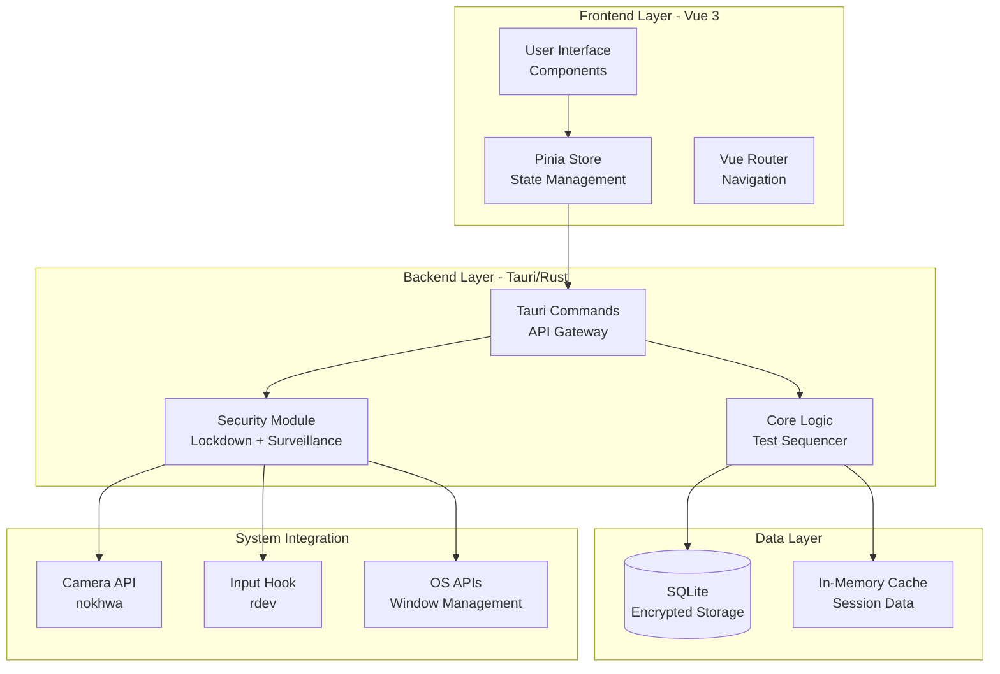
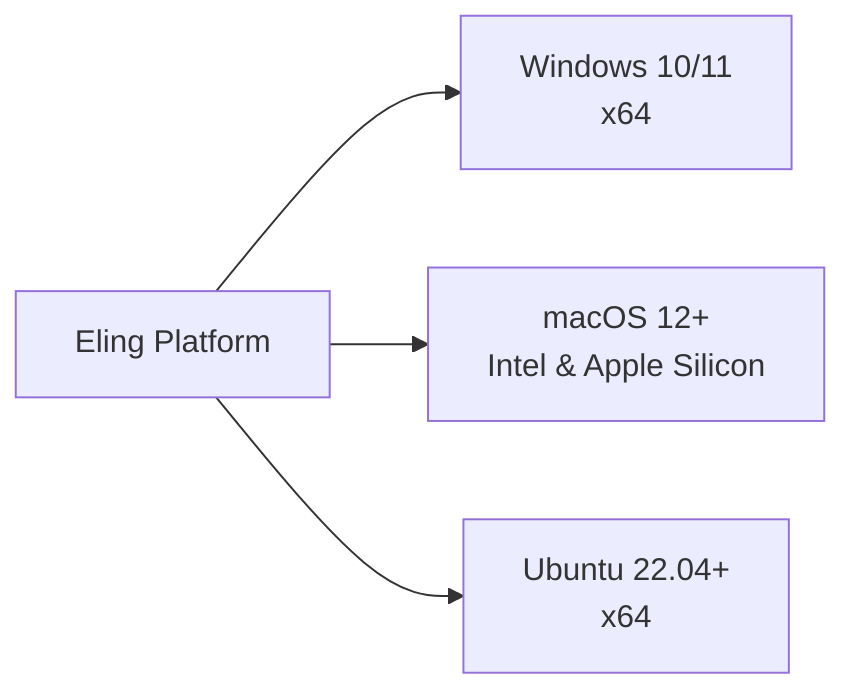
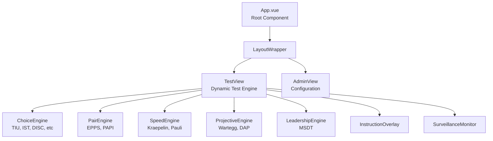
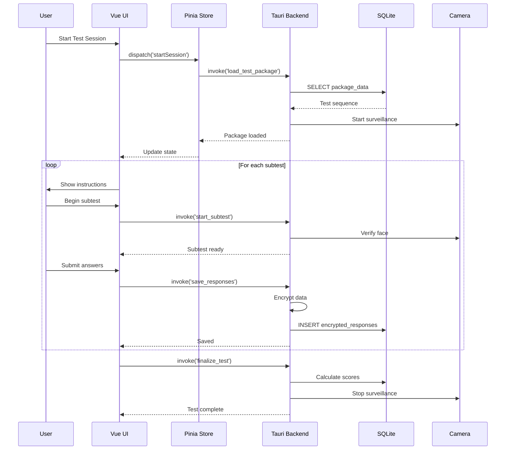
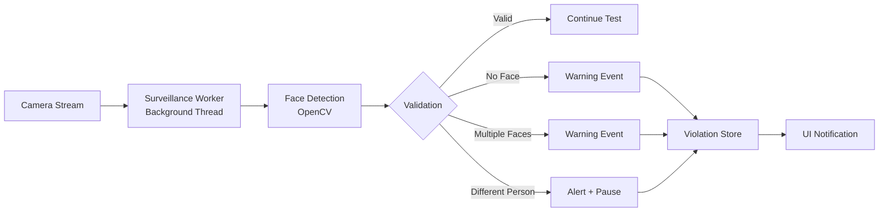
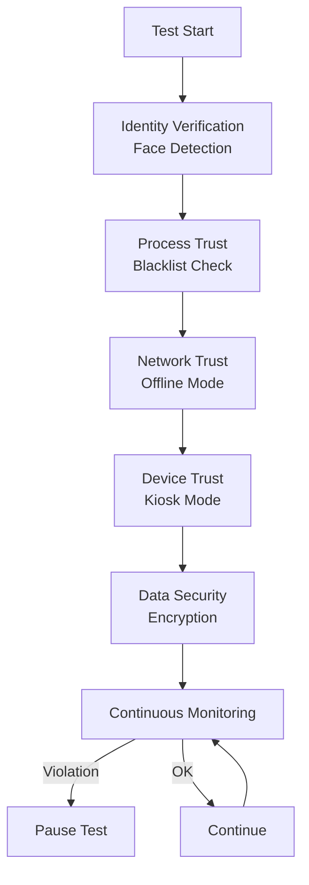
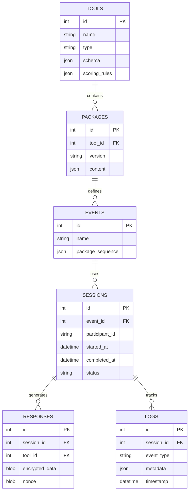

# System Architecture Overview - Eling Platform

> [!NOTE]
> Dokumen ini menjelaskan arsitektur end-to-end dari Eling - Modular Psychotest Platform, mencakup technology stack, design patterns, component interactions, dan architectural decisions.

---

## 1. High-Level Architecture



---

## 2. Technology Stack

### 2.1 Frontend Stack

| Technology | Version | Purpose |
|------------|---------|---------|
| **Vue 3** | 3.4+ | Reactive UI framework with Composition API |
| **Pinia** | 2.1+ | State management (Vuex successor) |
| **TypeScript** | 5.0+ | Type safety and better DX |
| **Vite** | 5.0+ | Fast build tool and HMR |
| **TailwindCSS** | 3.4+ | Utility-first CSS framework |

**Key Libraries:**
- `vue-router` - Client-side routing
- `vueuse` - Composition API utilities
- `chart.js` / `vue-chartjs` - Data visualization
- `fabric.js` - Canvas manipulation (Wartegg/DAP)

---

### 2.2 Backend Stack

| Technology | Version | Purpose |
|------------|---------|---------|
| **Rust** | 1.75+ | Systems programming language |
| **Tauri** | 2.0+ | Desktop app framework |
| **Tokio** | 1.35+ | Async runtime |
| **SQLite** | 3.45+ | Embedded database |

**Key Crates:**
- `serde` / `serde_json` - Serialization
- `sqlx` - Async SQL queries
- `aes-gcm` - Encryption
- `zeroize` - Secure memory clearing
- `nokhwa` - Camera access
- `rdev` - Input hook
- `window-shadows` - UI enhancement

---

### 2.3 Platform Support



---

## 3. Architectural Patterns

### 3.1 Layered Architecture

```
┌─────────────────────────────────────────┐
│   Presentation Layer (Vue 3)            │
│   - Components, Views, Stores           │
└────────────┬────────────────────────────┘
             │ Tauri Commands (JSON-RPC)
┌────────────▼────────────────────────────┐
│   Application Layer (Rust)              │
│   - Business Logic, Sequencer           │
└────────────┬────────────────────────────┘
             │ Domain Models
┌────────────▼────────────────────────────┐
│   Domain Layer (Rust)                   │
│   - Entities, Value Objects             │
└────────────┬────────────────────────────┘
             │ Repository Pattern
┌────────────▼────────────────────────────┐
│   Data Access Layer (SQLx)              │
│   - Database Operations                 │
└─────────────────────────────────────────┘
```

---

### 3.2 Component-Based Architecture (Frontend)



**Design Pattern:** **Strategy Pattern**
- `<component :is="currentEngine" />` memilih engine berdasarkan tool type
- Setiap engine implements interface yang sama untuk consistency

---

### 3.3 Modular Backend Architecture

```rust
// Module Structure
eling/
├── src-tauri/
│   ├── src/
│   │   ├── main.rs              // Entry point
│   │   ├── commands/            // Tauri command handlers
│   │   │   ├── mod.rs
│   │   │   ├── test.rs          // Test execution commands
│   │   │   ├── auth.rs          // Authentication
│   │   │   └── surveillance.rs  // Camera commands
│   │   ├── core/                // Business logic
│   │   │   ├── sequencer.rs     // Test sequencer
│   │   │   ├── scorer.rs        // Scoring algorithms
│   │   │   └── timer.rs         // Precision timer
│   │   ├── security/            // Security modules
│   │   │   ├── lockdown.rs      // Input blocking
│   │   │   ├── encryption.rs    // AES-256-GCM
│   │   │   ├── face_detect.rs   // CV processing
│   │   │   └── process_monitor.rs
│   │   ├── db/                  // Database layer
│   │   │   ├── models.rs        // Entity models
│   │   │   ├── repository.rs    // Data access
│   │   │   └── migrations/
│   │   └── utils/               // Helpers
```

**Design Patterns:**
- **Repository Pattern** - Data access abstraction
- **Command Pattern** - Tauri command handlers
- **Observer Pattern** - Event emission to frontend
- **Singleton Pattern** - Database connection pool

---

## 4. Data Flow Architecture

### 4.1 Test Execution Flow



---

### 4.2 Surveillance Flow



**Threading Model:**
- **Main Thread:** UI rendering (Vue)
- **Tauri Thread:** Command processing
- **Surveillance Thread:** Camera processing (dedicated)
- **Timer Thread:** High-precision test timers

---

## 5. Security Architecture

### 5.1 Zero Trust Implementation



---

### 5.2 Security Layers

| Layer | Implementation | Purpose |
|-------|----------------|---------|
| **Identity** | Face recognition | Verify test taker |
| **Process** | Process blacklist | Block unauthorized apps |
| **Device** | Kiosk mode | Prevent desktop access |
| **Network** | Offline-first | No data exfiltration |
| **Data** | AES-256-GCM | Protect stored answers |
| **Input** | `rdev` hooks | Block OS shortcuts |

---

### 5.3 Encryption Strategy

```rust
// Data Encryption Architecture
┌─────────────────┐
│  User Input     │
└────────┬────────┘
         │
         ▼
┌─────────────────┐      ┌──────────────┐
│  Serialize      │─────→│ Session Key  │
│  to JSON        │      │ (Ephemeral)  │
└────────┬────────┘      └──────┬───────┘
         │                       │
         ▼                       ▼
┌─────────────────────────────────┐
│  AES-256-GCM Encryption         │
│  • 256-bit key                  │
│  • 96-bit nonce (random)        │
│  • Authentication tag           │
└────────┬────────────────────────┘
         │
         ▼
┌─────────────────┐
│  Encrypted Blob │
│  Stored in DB   │
└─────────────────┘
```

**Key Features:**
- **Ephemeral Keys:** Generated per session, destroyed after test
- **Memory Protection:** `zeroize` crate untuk secure deletion
- **No Key Storage:** Keys never written to disk
- **Forward Secrecy:** Captured data useless without session key

---

## 6. Database Schema Architecture

### 6.1 Entity Relationship Diagram



---

### 6.2 Data Access Pattern

**Repository Pattern Implementation:**

```rust
// Abstract repository trait
#[async_trait]
pub trait Repository<T> {
    async fn find_by_id(&self, id: i64) -> Result<T>;
    async fn save(&self, entity: &T) -> Result<i64>;
    async fn delete(&self, id: i64) -> Result<()>;
}

// Concrete implementation
pub struct ResponseRepository {
    pool: SqlitePool,
}

impl ResponseRepository {
    pub async fn save_encrypted(
        &self,
        session_id: i64,
        tool_id: i64,
        encrypted_data: Vec<u8>,
        nonce: Vec<u8>,
    ) -> Result<i64> {
        sqlx::query!(
            "INSERT INTO responses (session_id, tool_id, encrypted_data, nonce) 
             VALUES (?, ?, ?, ?)",
            session_id, tool_id, encrypted_data, nonce
        )
        .execute(&self.pool)
        .await
        .map(|r| r.last_insert_rowid())
    }
}
```

---

## 7. Component Communication

### 7.1 Frontend-Backend Interface (Tauri Commands)

```typescript
// Frontend (TypeScript)
import { invoke } from '@tauri-apps/api/core';

interface TestPackage {
  id: number;
  name: string;
  tools: Tool[];
}

// Call Rust backend
const package = await invoke<TestPackage>('load_test_package', { 
  eventId: 1 
});
```

```rust
// Backend (Rust)
#[tauri::command]
async fn load_test_package(
    event_id: i64,
    state: State<'_, AppState>,
) -> Result<TestPackage, String> {
    let repo = &state.event_repository;
    repo.get_package(event_id)
        .await
        .map_err(|e| e.to_string())
}
```

---

### 7.2 Event-Driven Communication

**Backend → Frontend Events:**

```rust
// Rust: Emit event to frontend
app.emit("surveillance:violation", ViolationEvent {
    violation_type: "multiple_faces",
    timestamp: Utc::now(),
});
```

```typescript
// Vue: Listen to events
import { listen } from '@tauri-apps/api/event';

listen('surveillance:violation', (event) => {
  store.commit('addViolation', event.payload);
  showWarningDialog();
});
```

---

## 8. State Management Architecture

### 8.1 Pinia Store Structure

```typescript
// stores/test.ts
export const useTestStore = defineStore('test', {
  state: () => ({
    currentPackage: null as TestPackage | null,
    currentToolIndex: 0,
    responses: new Map<number, any>(),
    violations: [] as Violation[],
    sessionStatus: 'idle' as SessionStatus,
  }),
  
  getters: {
    currentTool: (state) => state.currentPackage?.tools[state.currentToolIndex],
    violationCount: (state) => state.violations.length,
    canProceed: (state) => state.violations.length < 3,
  },
  
  actions: {
    async startSession(eventId: number) {
      const pkg = await invoke('load_test_package', { eventId });
      this.currentPackage = pkg;
      this.sessionStatus = 'active';
    },
    
    async submitResponse(toolId: number, data: any) {
      await invoke('save_response', { toolId, data });
      this.responses.set(toolId, data);
    },
  },
});
```

---

## 9. Deployment Architecture

### 9.1 Build Artifacts

```
Build Output Structure:
├── eling_1.0.0_x64.msi          (Windows)
├── eling_1.0.0_x64.dmg          (macOS Intel)
├── eling_1.0.0_aarch64.dmg      (macOS Apple Silicon)
└── eling_1.0.0_amd64.AppImage   (Linux)
```

---

### 9.2 Application Structure

```
Installation Directory:
eling/
├── bin/
│   └── eling                     # Main executable
├── resources/
│   ├── icons/                    # App icons
│   └── templates/                # Report templates
├── data/
│   └── eling.db                  # SQLite database
└── config/
    └── settings.json             # User preferences
```

---

## 10. Scalability Considerations

### 10.1 Performance Optimization

**Strategies:**
1. **Virtual Scrolling** - Efficient rendering of large lists
2. **Lazy Loading** - Load components on demand
3. **Web Workers** - Offload heavy computations
4. **Database Indexing** - Fast query performance
5. **Connection Pooling** - Reuse DB connections

---

### 10.2 Future Extensibility

**Plugin Architecture (Future Enhancement):**

```rust
// Trait for custom tools
pub trait PsychoTool {
    fn name(&self) -> &str;
    fn schema(&self) -> serde_json::Value;
    fn score(&self, responses: &[Response]) -> Score;
}

// Users can create custom tools
pub struct CustomTool;
impl PsychoTool for CustomTool {
    // Implementation
}
```

---

## 11. Architectural Decision Records

### ADR-001: Why Tauri over Electron?

**Decision:** Use Tauri instead of Electron

**Rationale:**
- ✅ **Smaller Bundle:** ~3MB vs ~100MB (Electron)
- ✅ **Better Security:** Rust backend, no Node.js runtime exposure
- ✅ **Performance:** Native binary, less memory usage
- ✅ **System Integration:** Direct OS API access via Rust

---

### ADR-002: Why SQLite over Cloud Database?

**Decision:** Offline-first with SQLite

**Rationale:**
- ✅ **Zero Trust:** No network dependency eliminates data exfiltration risk
- ✅ **Privacy:** All data stays local
- ✅ **Reliability:** No internet requirement
- ✅ **Simplicity:** No server infrastructure needed

---

### ADR-003: Why Vue 3 over React?

**Decision:** Vue 3 with Composition API

**Rationale:**
- ✅ **Developer Experience:** Simpler mental model
- ✅ **Performance:** Vue 3 compiler optimizations
- ✅ **Ecosystem:** Pinia, VueUse, Vue Router integration
- ✅ **TypeScript Support:** First-class TS support

---

## Summary

**Architecture Highlights:**
- 🏗️ **Layered Architecture** untuk separation of concerns
- 🔒 **Zero Trust Security** di setiap layer
- ⚡ **High Performance** dengan Rust + Vue 3
- 🔌 **Modular Design** untuk extensibility
- 📱 **Cross-Platform** support (Windows, macOS, Linux)
- 🔐 **Offline-First** untuk maximum privacy

> [!TIP]
> Gunakan diagram yang disediakan sebagai referensi saat implementing features baru untuk memastikan consistency dengan architectural vision.
