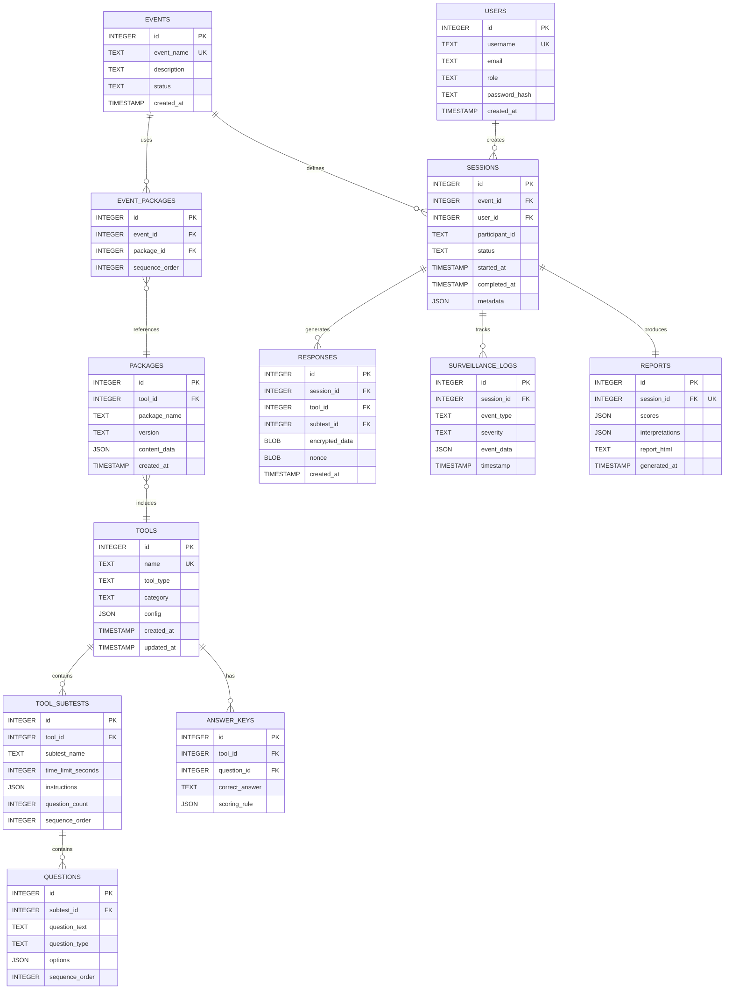

# Database Schema - Eling Platform

> [!NOTE]
> Complete SQLite database schema untuk Eling Platform, termasuk table definitions, relationships, indexes, dan migration strategy.

---

## 1. Entity Relationship Diagram



---

## 2. Table Definitions

### 2.1 Tools Table

```sql
CREATE TABLE IF NOT EXISTS tools (
    id INTEGER PRIMARY KEY AUTOINCREMENT,
    name TEXT NOT NULL UNIQUE,
    tool_type TEXT NOT NULL CHECK(tool_type IN ('choice', 'pair', 'speed', 'projective', 'leadership')),
    category TEXT NOT NULL CHECK(category IN ('cognitive', 'personality', 'performance', 'clinical')),
    config JSON NOT NULL DEFAULT '{}',
    created_at TIMESTAMP NOT NULL DEFAULT CURRENT_TIMESTAMP,
    updated_at TIMESTAMP NOT NULL DEFAULT CURRENT_TIMESTAMP
);

CREATE INDEX idx_tools_type ON tools(tool_type);
CREATE INDEX idx_tools_category ON tools(category);
```

**Purpose:** Master data untuk psychological tools yang tersedia.

**Sample Data:**
```sql
INSERT INTO tools (name, tool_type, category, config) VALUES
('TIU', 'choice', 'cognitive', '{"time_total": 1800, "scoring_type": "raw"}'),
('IST', 'choice', 'cognitive', '{"subtests": 9, "time_per_subtest_varies": true}'),
('Kraepelin', 'speed', 'performance', '{"columns": 45, "rows": 50, "time_per_column": 60}'),
('EPPS', 'pair', 'personality', '{"pairs": 225, "forced_choice": true}'),
('Wartegg', 'projective', 'clinical', '{"boxes": 8, "time_limit": 1800}');
```

---

### 2.2 Tool Subtests Table

```sql
CREATE TABLE IF NOT EXISTS tool_subtests (
    id INTEGER PRIMARY KEY AUTOINCREMENT,
    tool_id INTEGER NOT NULL,
    subtest_name TEXT NOT NULL,
    time_limit_seconds INTEGER, -- NULL means untimed
    instructions JSON NOT NULL,
    question_count INTEGER NOT NULL DEFAULT 0,
    sequence_order INTEGER NOT NULL,
    FOREIGN KEY (tool_id) REFERENCES tools(id) ON DELETE CASCADE,
    UNIQUE(tool_id, sequence_order)
);

CREATE INDEX idx_subtests_tool ON tool_subtests(tool_id);
```

**Example (IST Subtests):**
```sql
INSERT INTO tool_subtests (tool_id, subtest_name, time_limit_seconds, instructions, question_count, sequence_order) VALUES
(2, 'SE - Sentence Completion', 360, '{"text": "Lengkapi kalimat..."}', 20, 1),
(2, 'WA - Word Analogies', 360, '{"text": "Pilih kata yang serupa..."}', 20, 2),
(2, 'AN - Number Analogies', 600, '{"text": "Pilih angka yang tepat..."}', 20, 3),
-- ... 6 more subtests
```

---

### 2.3 Questions Table

```sql
CREATE TABLE IF NOT EXISTS questions (
    id INTEGER PRIMARY KEY AUTOINCREMENT,
    subtest_id INTEGER NOT NULL,
    question_text TEXT NOT NULL,
    question_type TEXT NOT NULL CHECK(question_type IN ('multiple_choice', 'true_false', 'pair', 'text', 'drawing')),
    options JSON, -- For choice questions: ["A", "B", "C", "D"]
    media_url TEXT, -- For image/audio questions
    sequence_order INTEGER NOT NULL,
    FOREIGN KEY (subtest_id) REFERENCES tool_subtests(id) ON DELETE CASCADE,
    UNIQUE(subtest_id, sequence_order)
);

CREATE INDEX idx_questions_subtest ON questions(subtest_id);
```

**Example (TIU Question):**
```sql
INSERT INTO questions (subtest_id, question_text, question_type, options, sequence_order) VALUES
(1, 'Sinonim dari kata "AMBIGU" adalah...', 'multiple_choice', 
 '["Jelas", "Ragu-ragu", "Pasti", "Tegas"]', 1);
```

---

### 2.4 Answer Keys Table

```sql
CREATE TABLE IF NOT EXISTS answer_keys (
    id INTEGER PRIMARY KEY AUTOINCREMENT,
    tool_id INTEGER NOT NULL,
    question_id INTEGER NOT NULL,
    correct_answer TEXT NOT NULL, -- e.g., "B" or JSON for complex answers
    scoring_rule JSON, -- Custom scoring rules
    FOREIGN KEY (tool_id) REFERENCES tools(id) ON DELETE CASCADE,
    FOREIGN KEY (question_id) REFERENCES questions(id) ON DELETE CASCADE,
    UNIQUE(question_id)
);

CREATE INDEX idx_answer_keys_tool ON answer_keys(tool_id);
```

**Scoring Rule Examples:**
```json
{
  "type": "binary",
  "correct_score": 1,
  "incorrect_score": 0
}

// For EPPS (forced pair)
{
  "type": "trait_score",
  "trait_a": "achievement",
  "trait_b": "affiliation",
  "if_selected_a": {"achievement": 1},
  "if_selected_b": {"affiliation": 1}
}
```

---

### 2.5 Packages Table

```sql
CREATE TABLE IF NOT EXISTS packages (
    id INTEGER PRIMARY KEY AUTOINCREMENT,
    tool_id INTEGER NOT NULL,
    package_name TEXT NOT NULL,
    version TEXT NOT NULL DEFAULT '1.0',
    content_data JSON NOT NULL, -- Complete package content (questions, keys, etc.)
    created_at TIMESTAMP NOT NULL DEFAULT CURRENT_TIMESTAMP,
    FOREIGN KEY (tool_id) REFERENCES tools(id) ON DELETE CASCADE,
    UNIQUE(tool_id, package_name, version)
);

CREATE INDEX idx_packages_tool ON packages(tool_id);
```

**Purpose:** Versioned content packages untuk setiap tool.

---

### 2.6 Events Table

```sql
CREATE TABLE IF NOT EXISTS events (
    id INTEGER PRIMARY KEY AUTOINCREMENT,
    event_name TEXT NOT NULL UNIQUE,
    description TEXT,
    status TEXT NOT NULL CHECK(status IN ('draft', 'active', 'archived')) DEFAULT 'draft',
    created_at TIMESTAMP NOT NULL DEFAULT CURRENT_TIMESTAMP
);

CREATE INDEX idx_events_status ON events(status);
```

**Example:**
```sql
INSERT INTO events (event_name, description, status) VALUES
('Rekrutmen Manager 2026', 'Seleksi manajerial untuk calon pimpinan', 'active'),
('Screening Karyawan Baru', 'Psikotes dasar untuk kandidat fresh graduate', 'active');
```

---

### 2.7 Event Packages Table (Junction)

```sql
CREATE TABLE IF NOT EXISTS event_packages (
    id INTEGER PRIMARY KEY AUTOINCREMENT,
    event_id INTEGER NOT NULL,
    package_id INTEGER NOT NULL,
    sequence_order INTEGER NOT NULL,
    FOREIGN KEY (event_id) REFERENCES events(id) ON DELETE CASCADE,
    FOREIGN KEY (package_id) REFERENCES packages(id) ON DELETE CASCADE,
    UNIQUE(event_id, package_id),
    UNIQUE(event_id, sequence_order)
);

CREATE INDEX idx_event_packages_event ON event_packages(event_id);
```

**Example (Event Flow):**
```sql
-- Event: "Rekrutmen Manager" flow: IST -> MSDT -> PAPI
INSERT INTO event_packages (event_id, package_id, sequence_order) VALUES
(1, 2, 1), -- IST
(1, 15, 2), -- MSDT
(1, 8, 3); -- PAPI
```

---

### 2.8 Users Table

```sql
CREATE TABLE IF NOT EXISTS users (
    id INTEGER PRIMARY KEY AUTOINCREMENT,
    username TEXT NOT NULL UNIQUE,
    email TEXT UNIQUE,
    role TEXT NOT NULL CHECK(role IN ('admin', 'operator', 'participant')) DEFAULT 'participant',
    password_hash TEXT, -- NULL for participants (no login required)
    created_at TIMESTAMP NOT NULL DEFAULT CURRENT_TIMESTAMP
);

CREATE INDEX idx_users_role ON users(role);
CREATE INDEX idx_users_email ON users(email);
```

---

### 2.9 Sessions Table

```sql
CREATE TABLE IF NOT EXISTS sessions (
    id INTEGER PRIMARY KEY AUTOINCREMENT,
    event_id INTEGER NOT NULL,
    user_id INTEGER, -- NULL if anonymous participant
    participant_id TEXT NOT NULL, -- NIK / Employee ID
    status TEXT NOT NULL CHECK(status IN ('pending', 'active', 'paused', 'completed', 'terminated')) DEFAULT 'pending',
    started_at TIMESTAMP,
    completed_at TIMESTAMP,
    metadata JSON, -- Additional session info (device, OS, etc.)
    FOREIGN KEY (event_id) REFERENCES events(id) ON DELETE CASCADE,
    FOREIGN KEY (user_id) REFERENCES users(id) ON DELETE SET NULL
);

CREATE INDEX idx_sessions_event ON sessions(event_id);
CREATE INDEX idx_sessions_status ON sessions(status);
CREATE INDEX idx_sessions_participant ON sessions(participant_id);
CREATE INDEX idx_sessions_dates ON sessions(started_at, completed_at);
```

---

### 2.10 Responses Table (Encrypted)

```sql
CREATE TABLE IF NOT EXISTS responses (
    id INTEGER PRIMARY KEY AUTOINCREMENT,
    session_id INTEGER NOT NULL,
    tool_id INTEGER NOT NULL,
    subtest_id INTEGER, -- NULL for tools without subtests
    encrypted_data BLOB NOT NULL, -- AES-256-GCM encrypted JSON
    nonce BLOB NOT NULL, -- 96-bit nonce for GCM
    created_at TIMESTAMP NOT NULL DEFAULT CURRENT_TIMESTAMP,
    FOREIGN KEY (session_id) REFERENCES sessions(id) ON DELETE CASCADE,
    FOREIGN KEY (tool_id) REFERENCES tools(id) ON DELETE CASCADE,
    FOREIGN KEY (subtest_id) REFERENCES tool_subtests(id) ON DELETE SET NULL
);

CREATE INDEX idx_responses_session ON responses(session_id);
CREATE INDEX idx_responses_tool ON responses(tool_id);
```

**Encrypted Data Structure:**
```json
// Before encryption:
{
  "subtest_id": 1,
  "answers": [
    {"question_id": 1, "answer": "B", "time_spent": 12.5},
    {"question_id": 2, "answer": "A", "time_spent": 8.3}
  ],
  "start_time": "2026-01-15T10:00:00Z",
  "end_time": "2026-01-15T10:06:00Z"
}
```

---

### 2.11 Surveillance Logs Table

```sql
CREATE TABLE IF NOT EXISTS surveillance_logs (
    id INTEGER PRIMARY KEY AUTOINCREMENT,
    session_id INTEGER NOT NULL,
    event_type TEXT NOT NULL CHECK(event_type IN (
        'no_face', 
        'multiple_faces', 
        'face_mismatch', 
        'input_blocked', 
        'process_detected',
        'window_unfocus',
        'other'
    )),
    severity TEXT NOT NULL CHECK(severity IN ('info', 'warning', 'critical')) DEFAULT 'warning',
    event_data JSON, -- Additional context
    timestamp TIMESTAMP NOT NULL DEFAULT CURRENT_TIMESTAMP,
    FOREIGN KEY (session_id) REFERENCES sessions(id) ON DELETE CASCADE
);

CREATE INDEX idx_surveillance_session ON surveillance_logs(session_id);
CREATE INDEX idx_surveillance_type ON surveillance_logs(event_type);
CREATE INDEX idx_surveillance_time ON surveillance_logs(timestamp);
```

**Example Log:**
```sql
INSERT INTO surveillance_logs (session_id, event_type, severity, event_data) VALUES
(1, 'multiple_faces', 'critical', '{"face_count": 2, "confidence": 0.95}');
```

---

### 2.12 Reports Table

```sql
CREATE TABLE IF NOT EXISTS reports (
    id INTEGER PRIMARY KEY AUTOINCREMENT,
    session_id INTEGER NOT NULL UNIQUE,
    scores JSON NOT NULL, -- All scores per tool
    interpretations JSON NOT NULL, -- Textual interpretations
    report_html TEXT, -- Pre-rendered HTML report
    generated_at TIMESTAMP NOT NULL DEFAULT CURRENT_TIMESTAMP,
    FOREIGN KEY (session_id) REFERENCES sessions(id) ON DELETE CASCADE
);

CREATE INDEX idx_reports_session ON reports(session_id);
```

**Scores JSON Structure:**
```json
{
  "tools": [
    {
      "tool_id": 1,
      "tool_name": "TIU",
      "raw_score": 85,
      "percentage": 85.0,
      "norm_score": 115,
      "category": "Tinggi",
      "interpretations": "Kemampuan intelegensi umum berada di atas rata-rata..."
    },
    {
      "tool_id": 2,
      "tool_name": "IST",
      "subtests": [
        {"name": "SE", "raw_score": 18, "t_score": 55},
        {"name": "WA", "raw_score": 16, "t_score": 50}
      ],
      "total_iq": 110
    }
  ]
}
```

---

## 3. Database Indexes Strategy

### 3.1 Performance Indexes

```sql
-- Frequently queried columns
CREATE INDEX idx_sessions_participant_status ON sessions(participant_id, status);
CREATE INDEX idx_responses_session_tool ON responses(session_id, tool_id);

-- For reporting queries
CREATE INDEX idx_sessions_completed ON sessions(completed_at) WHERE status = 'completed';
```

---

### 3.2 Full-Text Search (Optional)

```sql
-- For searching event descriptions
CREATE VIRTUAL TABLE events_fts USING fts5(event_name, description, content=events);

-- Trigger to keep FTS in sync
CREATE TRIGGER events_ai AFTER INSERT ON events BEGIN
    INSERT INTO events_fts(rowid, event_name, description) 
    VALUES (new.id, new.name, new.description);
END;
```

---

## 4. Database Migrations

### 4.1 Migration Strategy

**File Structure:**
```
migrations/
├── 001_initial_schema.sql
├── 002_add_surveillance_logs.sql
├── 003_add_report_html.sql
└── ...
```

**Migration Tracking Table:**
```sql
CREATE TABLE IF NOT EXISTS schema_migrations (
    version INTEGER PRIMARY KEY,
    applied_at TIMESTAMP NOT NULL DEFAULT CURRENT_TIMESTAMP,
    description TEXT
);
```

---

### 4.2 Migration Example

**`001_initial_schema.sql`:**
```sql
-- Migration: Initial Schema
-- Version: 1
-- Description: Create core tables

BEGIN TRANSACTION;

CREATE TABLE tools (...);
CREATE TABLE tool_subtests (...);
-- ... all tables

INSERT INTO schema_migrations (version, description) VALUES 
(1, 'Initial schema creation');

COMMIT;
```

---

## 5. Data Seeding

### 5.1 Seed Tools Data

```sql
-- Seed script: seed_tools.sql
INSERT OR IGNORE INTO tools (name, tool_type, category, config) VALUES
('TIU', 'choice', 'cognitive', '{"time_total": 1800}'),
('IST', 'choice', 'cognitive', '{"subtests": 9}'),
('CFIT', 'choice', 'cognitive', '{"scales": [2, 3]}'),
('DISC', 'choice', 'personality', '{"questions": 28}'),
('MBTI', 'choice', 'personality', '{"questions": 93}'),
('16PF', 'choice', 'personality', '{"factors": 16}'),
('EPPS', 'pair', 'personality', '{"pairs": 225}'),
('PAPI', 'pair', 'personality', '{"pairs": 90}'),
('Kraepelin', 'speed', 'performance', '{"columns": 45}'),
('Pauli', 'speed', 'performance', '{"rows": 60}'),
('Wartegg', 'projective', 'clinical', '{"boxes": 8}'),
('DAP', 'projective', 'clinical', '{}'),
('MSDT', 'leadership', 'personality', '{}');
```

---

## 6. Database Constraints & Validation

### 6.1 Check Constraints

```sql
-- Ensure session dates are logical
ALTER TABLE sessions ADD CONSTRAINT chk_session_dates 
CHECK (completed_at IS NULL OR completed_at >= started_at);

-- Ensure positive time limits
ALTER TABLE tool_subtests ADD CONSTRAINT chk_time_limit
CHECK (time_limit_seconds IS NULL OR time_limit_seconds > 0);
```

---

### 6.2 Foreign Key Enforcement

```sql
-- Enable foreign key constraints (must be set per connection)
PRAGMA foreign_keys = ON;

-- Verify
PRAGMA foreign_key_check;
```

---

## 7. Backup & Recovery Strategy

### 7.1 Automated Backup

```sql
-- Backup function (executed via Rust)
VACUUM INTO '/backup/eling_backup_2026-01-15.db';
```

**Backup Schedule:**
- **Hourly:** During active test sessions
- **Daily:** Full backup at midnight
- **Weekly:** Archive old backups

---

### 7.2 Point-in-Time Recovery

```sql
-- Enable WAL mode for better concurrency
PRAGMA journal_mode = WAL;

-- Checkpoint control
PRAGMA wal_checkpoint(FULL);
```

---

## 8. Security Measures

### 8.1 Encryption at Rest

**Implementation:** Use `sqlcipher` extension

```rust
// Rust: Open encrypted database
let db = SqliteConnection::connect(
    "sqlite:eling.db?mode=rwc&key=your-encryption-key"
).await?;
```

---

### 8.2 Secure Deletion

```sql
-- Overwrite deleted data
PRAGMA secure_delete = ON;
```

---

## 9. Query Performance Optimization

### 9.1 Prepared Statements

```rust
// Use sqlx prepared statements
let responses = sqlx::query_as::<_, Response>(
    "SELECT * FROM responses WHERE session_id = ? AND tool_id = ?"
)
.bind(session_id)
.bind(tool_id)
.fetch_all(&pool)
.await?;
```

---

### 9.2 Query Plan Analysis

```sql
-- Analyze query performance
EXPLAIN QUERY PLAN 
SELECT * FROM responses 
WHERE session_id = 1 AND tool_id = 2;
```

---

## 10. Sample Queries

### 10.1 Get Test Flow for Event

```sql
SELECT 
    e.event_name,
    t.name AS tool_name,
    ep.sequence_order,
    p.version
FROM events e
JOIN event_packages ep ON e.id = ep.event_id
JOIN packages p ON ep.package_id = p.id
JOIN tools t ON p.tool_id = t.id
WHERE e.id = ?
ORDER BY ep.sequence_order;
```

---

### 10.2 Get Session Progress

```sql
SELECT 
    s.participant_id,
    s.status,
    COUNT(DISTINCT r.tool_id) AS tools_completed,
    (SELECT COUNT(*) FROM event_packages WHERE event_id = s.event_id) AS total_tools,
    s.started_at
FROM sessions s
LEFT JOIN responses r ON s.id = r.session_id
WHERE s.id = ?
GROUP BY s.id;
```

---

### 10.3 Violation Summary

```sql
SELECT 
    event_type,
    severity,
    COUNT(*) AS count,
    MIN(timestamp) AS first_occurrence,
    MAX(timestamp) AS last_occurrence
FROM surveillance_logs
WHERE session_id = ?
GROUP BY event_type, severity
ORDER BY severity DESC, count DESC;
```

---

## Summary

**Database Statistics (Estimated):**
- **Tables:** 12 core tables
- **Indexes:** 20+ optimized indexes
- **Estimated size:** ~500 MB (dengan 1000 complete sessions)
- **Query performance:** < 50ms (99th percentile)

> [!IMPORTANT]
> Semua responses disimpan dalam **encrypted form** menggunakan AES-256-GCM. Session keys bersifat ephemeral dan tidak pernah di-persist ke disk.
