# Data Flow Diagram - Eling Platform

> [!NOTE]
> Dokumen ini menjelaskan aliran data secara detail dalam Eling Platform, dari user interaction hingga database persistence, termasuk security checks dan event handling.

---

## 1. Complete System Data Flow

```mermaid
flowchart TB
    subgraph User["👤 User Layer"]
        UserInput[User Interaction]
        Display[Display Output]
    end
    
    subgraph Frontend["🎨 Frontend Layer (Vue 3)"]
        Components[UI Components]
        Store[Pinia Store]
        Validators[Input Validators]
    end
    
    subgraph Backend["⚙️ Backend Layer (Tauri/Rust)"]
        Commands[Command Handlers]
        Logic[Business Logic]
        Sequencer[Test Sequencer]
        Scorer[Scoring Engine]
        Security[Security Module]
    end
    
    subgraph Data["💾 Data Layer"]
        Cache[In-Memory Cache]
        DB[(SQLite Encrypted)]
    end
    
    subgraph External["🔌 External Systems"]
        Camera[Camera API]
        OS[OS APIs]
    end
    
    UserInput --> Components
    Components --> Validators
    Validators --> Store
    Store <-->|Tauri Commands| Commands
    Commands --> Logic
    Logic --> Sequencer
    Logic --> Scorer
    Logic --> Security
    Security <--> Camera
    Security <--> OS
    Sequencer --> Cache
    Logic --> DB
    DB --> Logic
    Logic --> Commands
    Commands -->|Events| Store
    Store --> Components
    Components --> Display
```

---

## 2. Test Session Lifecycle Data Flow

### 2.1 Session Initialization

---

### 2.2 Subtest Execution Flow

---

## 3. Answer Submission Flow

### 3.1 Single Answer Flow (e.g., TIU Question)

```mermaid
sequenceDiagram
    participant UI as UI Component
    participant Store as Pinia Store
    participant Valid as Validator
    participant Cmd as Commands
    participant Enc as Encryption
    participant DB as Database
    
    UI->>Store: submitAnswer(questionId, answer)
    Store->>Valid: validate(answer)
    
    alt Invalid Input
        Valid-->>Store: ❌ Validation error
        Store-->>UI: Show error message
    else Valid Input
        Valid-->>Store: ✅ Valid
        Store->>Store: updateLocalState(questionId, answer)
        Store->>Cmd: invoke('save_response', {sessionId, questionId, answer})
        
        Cmd->>Enc: encrypt(answer, sessionKey)
        Enc-->>Cmd: encryptedData + nonce
        
        Cmd->>DB: INSERT INTO responses (encrypted_data, nonce)
        DB-->>Cmd: ✅ Saved (rowId)
        
        Cmd-->>Store: emit('response:saved', {questionId, rowId})
        Store-->>UI: ✅ Show success indicator
    end
```

---

### 3.2 Bulk Answer Flow (e.g., Kraepelin)

**Optimization:**
- **Debouncing:** Menghindari terlalu banyak writes
- **Batching:** Menggabungkan multiple inputs menjadi satu transaction
- **Compression:** Mengurangi size untuk bulk data

---

## 4. Surveillance Data Flow

### 4.1 Real-time Face Detection

---

### 4.2 Violation Handling Flow

---

## 5. Security Event Flow

### 5.1 Input Blocking Flow

---

### 5.2 Process Monitoring Flow

---

## 6. Scoring Data Flow

### 6.1 Score Calculation Flow

---

### 6.2 Scoring Algorithm Example (TIU)

---

## 7. Report Generation Flow

---

## 8. Cache Management Flow

### 8.1 Session Cache Strategy

**Cache Items:**
- Test package definitions (TTL: Session lifetime)
- Current subtest data (TTL: Until subtest complete)
- User profile (TTL: Session lifetime)
- Answer keys (TTL: 1 hour)

---

## 9. Error Handling Flow

---

## 10. Data Persistence Strategy

### 10.1 Write Strategies by Data Type

| Data Type | Strategy | Rationale |
|-----------|----------|-----------|
| **Responses** | Immediate encrypted write | Critical data, cannot be lost |
| **Session metadata** | Write on state change | Moderate importance |
| **Violations** | Batched write (10s interval) | Non-critical, can tolerate delay |
| **Camera frames** | Not persisted | Too large, reconstruct from violations |
| **Scores** | Write on completion | One-time calculation |
| **Reports** | Write on generation | User-triggered |

---

### 10.2 Transaction Management

```mermaid
sequenceDiagram
    participant App
    participant TxManager as Transaction Manager
    participant DB
    
    App->>TxManager: beginTransaction()
    TxManager->>DB: BEGIN TRANSACTION
    
    App->>TxManager: execute(query1)
    TxManager->>DB: INSERT responses
    
    App->>TxManager: execute(query2)
    TxManager->>DB: UPDATE session
    
    alt Success
        App->>TxManager: commit()
        TxManager->>DB: COMMIT
        DB-->>App: ✅ Success
    else Error
        App->>TxManager: rollback()
        TxManager->>DB: ROLLBACK
        DB-->>App: ❌ Rolled back
    end
```

---

## 11. Performance Optimization Data Flows

### 11.1 Lazy Loading Strategy

---

### 11.2 Virtual Scrolling Flow (Kraepelin)

---

## Summary: Data Flow Principles

> [!IMPORTANT]
> **Core Principles:**
> 1. **Security First:** Semua sensitive data dienkripsi sebelum persist
> 2. **Performance:** Debouncing, batching, dan caching untuk optimal UX
> 3. **Reliability:** Transaction management dan error handling
> 4. **Privacy:** Minimal data collection, local-only processing
> 5. **Auditability:** Comprehensive logging untuk compliance

**Key Metrics:**
- Response save latency: < 100ms
- Face detection latency: < 200ms (5 FPS)
- UI render time: < 16ms (60 FPS)
- Database query time: < 50ms (99th percentile)

