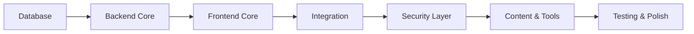

# Implementation Roadmap - Eling Platform

> [!NOTE]
> Step-by-step guide untuk implementation, termasuk dependency order dan integration checkpoints.

---

## Development Approach

**Strategy:** Bottom-up + Iterative



---

## Stage 1: Foundation Layer

### 1.1 Database Setup
```bash
# Priority: CRITICAL | Duration: 2 days

1. Create SQLite database file
2. Implement all 12 tables (see DATABASE_SCHEMA.md)
3. Create migration system
4. Add indexes
5. Seed basic tool definitions
```

**Validation:**
```sql
-- Check all tables exist
SELECT name FROM sqlite_master WHERE type='table';

-- Verify foreign keys
PRAGMA foreign_key_check;
```

---

### 1.2 Tauri Project Scaffold
```bash
# Priority: CRITICAL | Duration: 1 day

1. Initialize Tauri project: npm create tauri-app
2. Configure tauri.conf.json
3. Setup Rust workspace
4. Add dependencies (Cargo.toml)
5. Verify build: cargo tauri dev
```

**Key Dependencies:**
```toml
[dependencies]
tauri = { version = "2.0", features = ["..."] }
tokio = { version = "1.35", features = ["full"] }
sqlx = { version = "0.7", features = ["sqlite", "runtime-tokio"] }
serde = { version = "1.0", features = ["derive"] }
serde_json = "1.0"
```

---

### 1.3 Frontend Scaffold
```bash
# Priority: CRITICAL | Duration: 1 day

1. Setup Vite + Vue 3 + TypeScript
2. Install Pinia, Vue Router
3. Create basic layout structure
4. Configure TailwindCSS
5. Test HMR
```

---

## Stage 2: Core Backend

### 2.1 Database Repository Layer
```rust
// Priority: HIGH | Duration: 3 days

/* Implement:
 * - src-tauri/src/db/models.rs (all entities)
 * - src-tauri/src/db/repository.rs (CRUD operations)
 * - Connection pool management
 */

// Example structure:
pub struct ToolRepository {
    pool: SqlitePool,
}

impl ToolRepository {
    pub async fn find_by_id(&self, id: i64) -> Result<Tool>;
    pub async fn find_all(&self) -> Result<Vec<Tool>>;
    // ...
}
```

**Testing:**
```rust
#[tokio::test]
async fn test_create_tool() {
    let repo = ToolRepository::new(test_pool()).await;
    let tool = Tool { name: "Test".to_string(), ... };
    let id = repo.save(&tool).await.unwrap();
    assert!(id > 0);
}
```

---

### 2.2 Tauri Commands (API Layer)
```rust
// Priority: HIGH | Duration: 2 days

/* Implement basic commands:
 * - create_session
 * - load_test_package
 * - start_subtest
 * - submit_responses
 * - complete_session
 */

#[tauri::command]
async fn create_session(
    event_id: i64,
    participant_id: String,
    state: State<'_, AppState>,
) -> Result<CreateSessionResponse, String> {
    // Implementation
}
```

**Checkpoint:** Frontend dapat invoke commands dan receive responses

---

## Stage 3: Frontend Core

### 3.1 Pinia State Management
```typescript
// Priority: HIGH | Duration: 2 days

// stores/test.ts
export const useTestStore = defineStore('test', {
  state: () => ({
    currentSession: null,
    currentPackage: null,
    responses: new Map(),
    violations: [],
  }),
  
  actions: {
    async startSession(eventId: number) { ... },
    async submitResponse(data: ResponseData) { ... },
  },
});
```

---

### 3.2 Template Engines (Priority Order)

**Build Order:**
1. **ChoiceEngine** (3 days) - Most common type
2. **SpeedEngine** (2 days) - Kraepelin critical path
3. **PairEngine** (2 days)
4. **ProjectiveEngine** (3 days) - Canvas complexity
5. **LeadershipEngine** (2 days)

**ChoiceEngine Implementation:**
```vue
<!-- components/engines/ChoiceEngine.vue -->
<script setup lang="ts">
const props = defineProps<{
  questions: Question[];
  config: EngineConfig;
}>();

const answers = ref<Map<number, string>>(new Map());

function submitAnswer(questionId: number, answer: string) {
  answers.value.set(questionId, answer);
  // Auto-save debounced
}
</script>
```

**Validation:** 
- Render 100+ questions tanpa lag
- Answer persistence working
- Navigation working

---

### 3.3 Test Sequencer
```typescript
// composables/useTestSequencer.ts
export function useTestSequencer() {
  const store = useTestStore();
  
  async function nextSubtest() {
    // 1. Save current responses
    // 2. Load next subtest
    // 3. Show instructions
    // 4. Start timer
  }
  
  return { nextSubtest, ... };
}
```

**Checkpoint:** Complete test flow working (instruction → test → next → complete)

---

## Stage 4: Security Layer

### 4.1 Input Lockdown
```rust
// Priority: HIGH | Duration: 3 days

use rdev::{listen, EventType};

fn init_input_blocker() {
    listen(move |event| {
        match event.event_type {
            EventType::KeyPress(key) => {
                if is_blocked_shortcut(&key) {
                    log_violation("input_blocked");
                    return None; // Block
                }
            }
            _ => {}
        }
        Some(event)
    }).unwrap();
}
```

**Testing:**
- Try all major shortcuts
- Verify all blocked
- Check violation logging

---

### 4.2 Window Lockdown
```rust
// Priority: HIGH | Duration: 1 day

fn enforce_kiosk_mode(window: &Window) {
    window.set_always_on_top(true)?;
    window.set_fullscreen(true)?;
    window.set_decorations(false)?;
    window.set_skip_taskbar(true)?;
}
```

---

### 4.3 Surveillance System
```rust
// Priority: HIGH | Duration: 5 days

/* Milestones:
 * Day 1-2: Camera integration (nokhwa)
 * Day 3: Face detection (opencv)
 * Day 4: Liveness detection
 * Day 5: Violation handling
 */

async fn surveillance_worker(session_id: i64, tx: mpsc::Sender<ViolationEvent>) {
    let camera = Camera::new().await?;
    let baseline = capture_baseline(&camera).await?;
    
    loop {
        let frame = camera.capture().await?;
        let faces = detect_faces(&frame)?;
        
        if faces.len() != 1 {
            tx.send(ViolationEvent::MultipleFaces).await?;
        } else {
            let similarity = compare_faces(&faces[0], &baseline);
            if similarity < 0.8 {
                tx.send(ViolationEvent::FaceMismatch).await?;
            }
        }
        
        sleep(Duration::from_millis(200)).await;
    }
}
```

**Checkpoint:**
- Camera stream visible
- Face detected in real-time
- Violations logged correctly

---

### 4.4 Encryption Layer
```rust
// Priority: CRITICAL | Duration: 3 days

use aes_gcm::{Aes256Gcm, Key, Nonce};
use zeroize::Zeroize;

pub struct EncryptionService {
    session_key: SessionKey,
}

impl EncryptionService {
    pub fn encrypt(&self, data: &str) -> (Vec<u8>, Vec<u8>) {
        // Return (ciphertext, nonce)
    }
    
    pub fn decrypt(&self, ciphertext: &[u8], nonce: &[u8]) -> String {
        // Decrypt
    }
}
```

---

## Stage 5: Content & Tools

### 5.1 Tool Data Import
```bash
# Priority: MEDIUM | Duration: 7 days

# Create data files for each tool
tools/
├── tiu.json          # Questions, keys, norms
├── ist.json
├── disc.json
├── kraepelin.json
└── ...

# Import script
python scripts/import_tools.py
```

---

### 5.2 Scoring Algorithms
```rust
// Priority: HIGH | Duration: 5 days

trait ScoringAlgorithm {
    fn calculate_raw_score(&self, responses: &[Response]) -> f64;
    fn apply_norms(&self, raw_score: f64) -> NormScore;
    fn interpret(&self, norm_score: &NormScore) -> String;
}

// Implementasi per tool
impl ScoringAlgorithm for TIUScorer { ... }
impl ScoringAlgorithm for ISTScorer { ... }
```

---

## Stage 6: Testing & Quality Assurance

### 6.1 Unit Tests
```bash
# Target: >80% coverage

cargo test --all
cargo tarpaulin --out Html
```

### 6.2 Integration Tests
```rust
#[tokio::test]
async fn test_complete_session_flow() {
    // 1. Create session
    // 2. Load package
    // 3. Start subtest
    // 4. Submit responses
    // 5. Complete session
    // 6. Verify scores
}
```

### 6.3 Security Tests
```bash
# Manual penetration testing
- Bypass attempts
- Photo spoofing
- Process blacklist
- Memory forensics
```

---

## Integration Checkpoints

### Checkpoint 1: Basic Functionality
- [ ] Database operations working
- [ ] Tauri commands responding
- [ ] Frontend displays data

### Checkpoint 2: Test Flow
- [ ] User dapat start test
- [ ] Questions render correctly
- [ ] Responses saved encrypted
- [ ] Session completes

### Checkpoint 3: Security
- [ ] Kiosk mode functional
- [ ] Surveillance active
- [ ] Violations logged
- [ ] Bypass attempts fail

### Checkpoint 4: Content Complete
- [ ] All 20+ tools available
- [ ] Scoring accurate
- [ ] Reports generated

### Checkpoint 5: Production Ready
- [ ] All tests passing
- [ ] Performance acceptable
- [ ] Security validated
- [ ] Documentation complete

---

## Parallel Workstreams

**Can be done in parallel:**
- Frontend UI design ↔ Backend API implementation
- Tool data preparation ↔ Scoring algorithm development
- Security testing ↔ Performance optimization

**Must be sequential:**
- Database → Backend → Frontend
- Core features → Security → Content
- Development → Testing → Deployment

---

## Daily Development Cycle

```
Morning:
  - Standup (15 min)
  - Code review (30 min)
  - Implementation (3-4 hours)

Afternoon:
  - Testing (1 hour)
  - Documentation (30 min)
  - Integration testing (1 hour)
  - Code cleanup (30 min)
```

---

## Success Metrics

**Week 2:** Database + Tauri scaffold ✅
**Week 6:** One complete test flow working ✅
**Week 9:** Security system operational ✅
**Week 12:** All tools + scoring ready ✅
**Week 14:** Production release ✅

> [!TIP]
> Commit frequently, test continuously, document as you go. Don't leave testing until the end!
