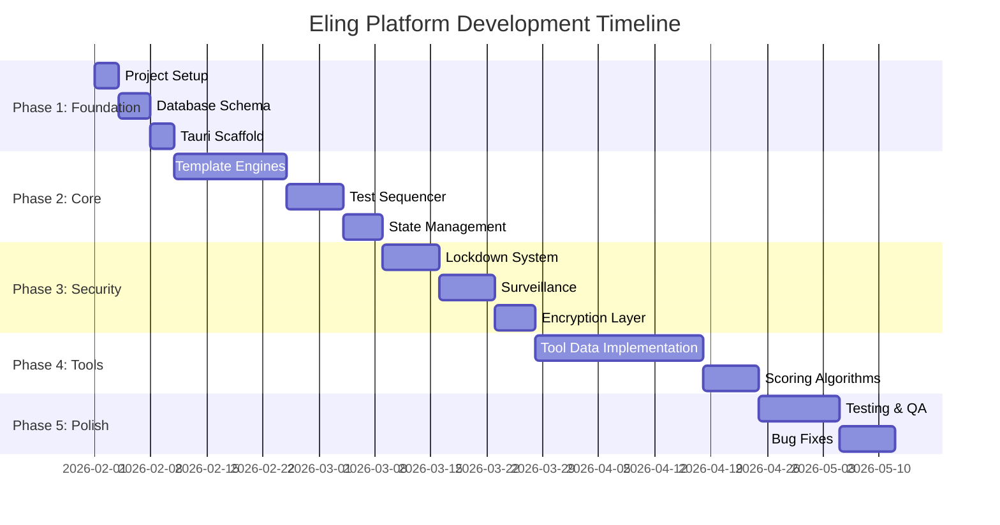
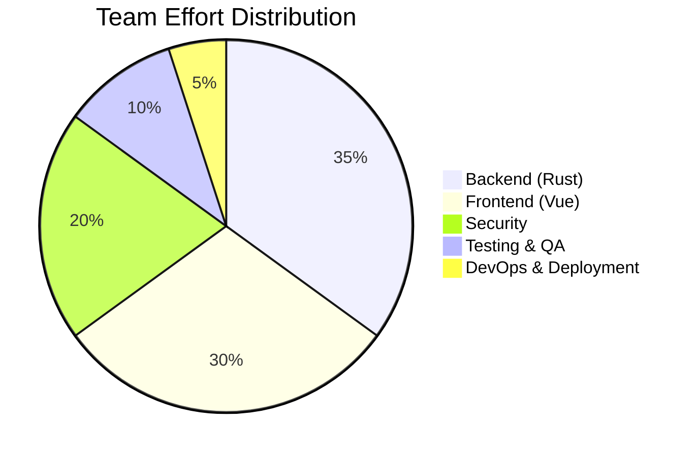

# Project Timeline - Eling Platform

> [!NOTE]
> 14-week development timeline dengan clear milestones dan deliverables.

---

## Timeline Overview

---

## Phase 1: Foundation (Week 1-2)

### Week 1: Project Setup
**Goals:**
- ✅ Repository setup dengan Git
- ✅ Development environment configuration
- ✅ Tauri project initialization
- ✅ Vue 3 + TypeScript + Vite setup
- ✅ SQLite database creation

**Deliverables:**
- Working dev environment
- "Hello World" Tauri app
- Basic database connection

---

### Week 2: Database & Architecture
**Goals:**
- ✅ Implement complete database schema
- ✅ Create migration system
- ✅ Seed sample data
- ✅ Setup Pinia stores
- ✅ Basic routing

**Deliverables:**
- Functional database with all tables
- Sample data untuk testing
- Frontend scaffolding

---

## Phase 2: Core Features (Week 3-6)

### Week 3-4: Template Engines
**Goals:**
- ✅ ChoiceEngine (TIU, IST, DISC, etc)
- ✅ PairEngine (EPPS, PAPI)
- ✅ SpeedEngine (Kraepelin, Pauli)
- ✅ ProjectiveEngine (Wartegg, DAP)
- ✅ LeadershipEngine (MSDT)

**Deliverables:**
- 5 working template engines
- Question rendering system
- Answer collection system

---

### Week 5: Test Sequencer
**Goals:**
- ✅ Package loading system
- ✅ Subtest transition logic
- ✅ Timer implementation
- ✅ Progress tracking

**Deliverables:**
- Complete test flow dari start → finish
- Instruction overlays
- Auto-save functionality

---

### Week 6: State Management & UI
**Goals:**
- ✅ Pinia store refinement
- ✅ UI components polish
- ✅ Responsive design
- ✅ Accessibility improvements

**Deliverables:**
- Clean, usable UI
- Proper state management
- Mobile-friendly (if applicable)

---

## Phase 3: Security (Week 7-9)

### Week 7: Lockdown Implementation
**Goals:**
- ✅ Always-on-top enforcement
- ✅ Fullscreen kiosk mode
- ✅ Input blocking (`rdev`)
- ✅ Process monitoring

**Deliverables:**
- Functional kiosk mode
- Shortcut blocking working
- Process blacklist active

---

### Week 8: Surveillance System
**Goals:**
- ✅ Camera integration (`nokhwa`)
- ✅ Face detection
- ✅ Liveness detection
- ✅ Violation logging

**Deliverables:**
- Working surveillance system
- Real-time violation alerts
- Face verification flow

---

### Week 9: Encryption & Data Security
**Goals:**
- ✅ AES-256-GCM implementation
- ✅ Key management system
- ✅ Secure deletion (zeroize)
- ✅ Database encryption

**Deliverables:**
- Encrypted response storage
- Ephemeral key system
- Security audit passed

---

## Phase 4: Tools Implementation (Week 10-12)

### Week 10-11: Content & Data
**Goals:**
- ✅ Import all 20+ psychological tools
- ✅ Question banks
- ✅ Answer keys
- ✅ Norms tables

**Deliverables:**
- Complete tool library
- All question data loaded
- Answer keys configured

---

### Week 12: Scoring & Reports
**Goals:**
- ✅ Scoring algorithms (all tools)
- ✅ Norm conversions (T-Score, IQ, etc)
- ✅ Report generation
- ✅ PDF export

**Deliverables:**
- Accurate scoring system
- Professional report templates
- Export functionality

---

## Phase 5: Testing & Polish (Week 13-14)

### Week 13: QA & Testing
**Goals:**
- ✅ Unit tests (>80% coverage)
- ✅ Integration tests
- ✅ E2E tests
- ✅ Security testing
- ✅ Performance benchmarks

**Deliverables:**
- Test suite passing
- Performance metrics met
- Security validated

---

### Week 14: Bug Fixes & Release
**Goals:**
- ✅ Fix all critical bugs
- ✅ Polish UI/UX
- ✅ Documentation
- ✅ Build release candidates
- ✅ Deployment prep

**Deliverables:**
- Release v1.0.0
- User documentation
- Installation packages (Windows, macOS, Linux)

---

## Milestones

| Milestone | Date | Deliverable |
|-----------|------|-------------|
| **M1: Foundation Complete** | Week 2 End | Database + Tauri scaffold |
| **M2: Core Features Complete** | Week 6 End | All test engines working |
| **M3: Security Complete** | Week 9 End | Zero Trust implemented |
| **M4: Content Complete** | Week 12 End | All tools + scoring ready |
| **M5: Release Ready** | Week 14 End | v1.0.0 shipped |

---

## Resource Allocation

---

## Risk Buffer

**Built-in Buffer:** 1 week per phase untuk unexpected issues

**Critical Path:**
- Template Engines → Test Sequencer → Security → Tools
- Delays di any step impact timeline significantly

---

## Dependencies

**External Dependencies:**
- Rust 1.75+
- Node.js 20+
- Python 3.10+ (untuk build tools)
- System libraries (OpenCV, SQLite)

**Internal Dependencies:**
- Database schema MUST bedone before anything else
- Template engines MUST be ready before tools
- Security MUST be tested before release

---

## Success Criteria

**End of Phase 1:**
- [ ] Database fully functional
- [ ] Basic Tauri app runs

**End of Phase 2:**
- [ ] User dapat complete mock test (1 tool)
- [ ] All engines working

**End of Phase 3:**
- [ ] Security bypass attempts fail
- [ ] Surveillance working

**End of Phase 4:**
- [ ] 20+ tools dengan complete data
- [ ] Accurate scoring

**End of Phase 5:**
- [ ] All tests passing
- [ ] Release packages built
- [ ] Documentation complete

> [!TIP]
> Use this timeline sebagai guidance, adjust berdasarkan actual progress. Weekly standups untuk track progress.
