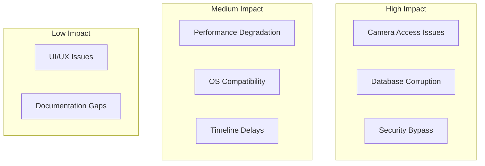
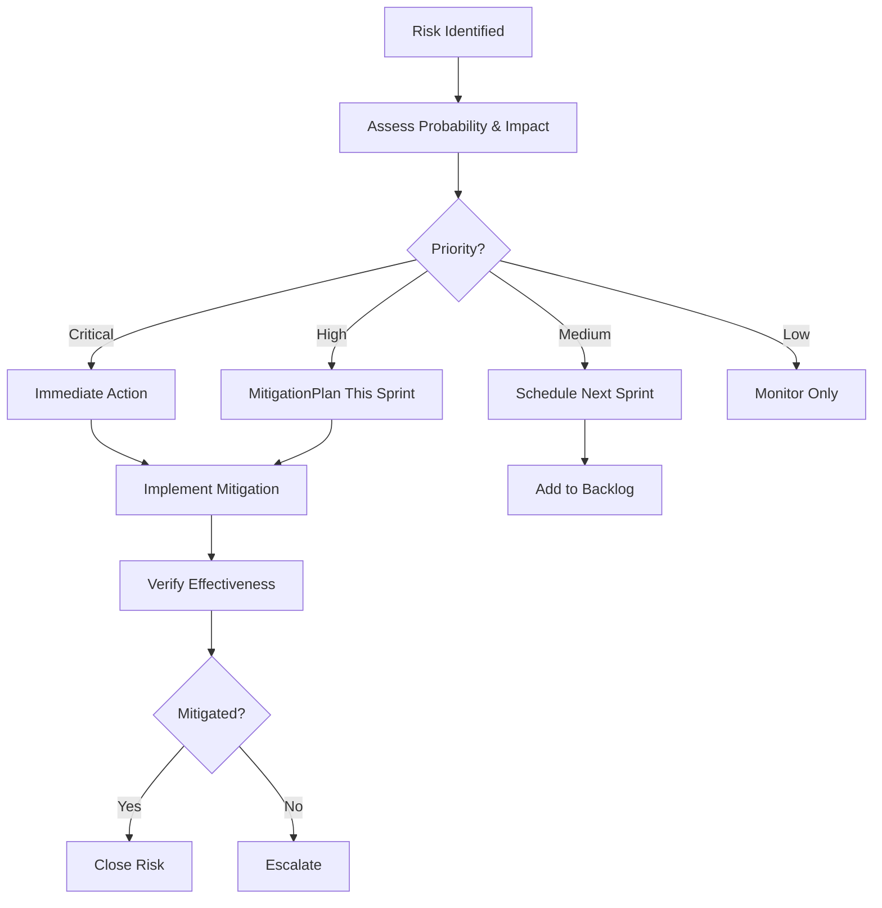

# Risk Assessment - Eling Platform

> Risk identification, impact analysis, dan mitigation strategies.

---

## Risk Matrix

---

## Technical Risks

### 1. Camera Access Denial
**Probability:** Medium | **Impact:** Critical

**Description:** OS denies camera permission, surveillance system tidak bisa jalan.

**Mitigation:**
- Clear permission request flow
- Graceful degradation (optional surveillance mode)
- User guide untuk enable camera permissions
- Fallback: Disable surveillance dengan warning

**Contingency:**
- Manual proctoring option
- Screenshot-based periodic verification

---

### 2. Cross-Platform Compatibility
**Probability:** High  **Impact:** High

**Description:** Features bekerja di satu OS tapi fail di OS lain.

**Mitigation:**
- Test di semua target platforms dari awal
- Use platform-agnostic libraries where possible
- CI/CD dengan matrix builds (Windows/macOS/Linux)
- Virtual machines untuk testing

**Platforms:**
- Windows 10/11 (Primary)
- macOS 12+ (Secondary)
- Ubuntu 22.04+ (Tertiary)

---

### 3. Performance Issues (Kraepelin)
**Probability:** Medium | **Impact:** High

**Description:** Input lag saat user mengetik ribuan angka dengan kamera aktif.

**Mitigation:**
- Virtual scrolling implementation
- Optimize render cycle
- Background thread untuk camera processing
- Performance benchmarking early
- Debouncing untuk auto-save

**Target Metrics:**
- Input latency < 16ms (60 FPS)
- Memory usage < 200MB
- No frame drops

---

### 4. Database Corruption
**Probability:** Low | **Impact:** Critical

**Description:** SQLite database corrupt, data test hilang.

**Mitigation:**
- Enable WAL mode untuk reliability
- Automated hourly backups during tests
- Transaction management dengan proper rollback
- PRAGMA integrity_check periodic

**Recovery:**
- Restore from latest backup
- Session resume capability
- Partial data recovery scripts

---

### 5. Encryption Key Loss
**Probability:** Low | **Impact:** Critical

**Description:** App crash sebelum test complete, session key hilang, responses tidak bisa decrypt.

**Mitigation:**
- Session key persistence option (encrypted)
- Recovery mode dengan admin master key
- Atomic writes untuk key storage
- Key derivation yang reproducible

**Note:** Balance antara security vs recoverability

---

## Security Risks

### 6. Sophisticated Bypass Attempts
**Probability:** Medium | **Impact:** Critical

**Description:** User menggunakan teknik advanced untuk bypass security (VM, hardware spoofing).

**Mitigation:**
- Layered security approach
- VM detection (CPU flags, hardware checks)
- Continuous monitoring
- Audit logs untuk forensics
- Regular penetration testing

**Detection:**
- Hardware fingerprinting
- Behavioral analysis
- Anomaly detection

---

### 7. Zero-Day Vulnerabilities
**Probability:** Low | **Impact:** High

**Description:** Vulnerability di Tauri, Rust dependencies, atau OS.

**Mitigation:**
- Regular dependency updates (Dependabot)
- Security advisories monitoring
- cargo-audit dalam CI/CD
- Quick patch deployment process

**Response Plan:**
- 24-hour patch for CRITICAL
- 7-day patch for HIGH
- Emergency update mechanism

---

## Operational Risks

### 8. Timeline Delays
**Probability:** High | **Impact:** Medium

**Description:** Features take longer than estimated, miss deadlines.

**Mitigation:**
- 1-week buffer per phase
- Weekly progress reviews
- Agile approach (MVP first, iterate)
- Parallel workstreams where possible
- Clear prioritization (must-have vs nice-to-have)

**Escalation:**
- Cut scope if necessary
- Focus on core features first
- Defer advanced features to v1.1

---

### 9. Resource Constraints
**Probability:** Medium | **Impact:** Medium

**Description:** Developers unavailable, blocking progress.

**Mitigation:**
- Cross-training team members
- Good documentation
- Knowledge sharing sessions
- Code reviews untuk knowledge distribution

---

### 10. Third-Party Library Issues
**Probability:** Medium | **Impact:** Medium

**Description:** Dependency abandoned, security issue, incompatibility.

**Mitigation:**
- Prefer mature, well-maintained libraries
- Have fallback alternatives identified
- Vendor critical dependencies if needed
- Regular dependency audits

**Critical Dependencies:**
- Tauri: Active, large community ✅
- nokhwa: Camera library (smaller, risk moderate)
- rdev: Input hooks (smaller, risk moderate)

---

## Compliance & Legal Risks

### 11. Privacy Regulation Violations
**Probability:** Low | **Impact:** High

**Description:** GDPR/PDPA non-compliance, fines, legal issues.

**Mitigation:**
- Privacy by design
- Clear consent mechanisms
- Data minimization
- Encryption at rest
- Right to deletion
- No unnecessary data collection

**Compliance Checklist:**
- [ ] Privacy policy drafted
- [ ] Consent flow implemented
- [ ] Data retention policy defined
- [ ] Encryption verified
- [ ] Audit trail available

---

### 12. Biometric Data Handling
**Probability:** Medium | **Impact:** High

**Description:** Face data mishandling, regulatory scrutiny.

**Mitigation:**
- Do NOT persist face embeddings
- In-memory only processing
- Clear disclosure to users
- Option to disable face verification
- Anonymize audit logs

---

## Business Risks

### 13. User Adoption
**Probability:** Low | **Impact:** Medium

**Description:** Users find app too restrictive, refuse to use.

**Mitigation:**
- Clear communication about why security needed
- Smooth onboarding
- Practice mode untuk familiarization
- Good UX despite restrictions
- Support documentation

---

### 14. Content Accuracy
**Probability:** Low | **Impact:** High

**Description:** Psychological test content errors, scoring bugs.

**Mitigation:**
- Expert review of all tool content
- Cross-validation dengan published norms
- Extensive testing dengan known cases
- Gradual rollout (beta testing)

---

## Risk Monitoring

**Weekly Reviews:**
- Active risks status
- New risks identified
- Mitigation effectiveness

**Metrics to Track:**
- Test coverage %
- Security scan results
- Performance benchmarks
- User feedback
- Bug severity distribution

---

## Risk Response Plan

---

## Summary: Top 5 Risks

1. **Camera Access Issues** - Critical impact, needs fallback
2. **Cross-Platform Compatibility** - Requires early & continuous testing
3. **Performance (Kraepelin)** - Optimize early, benchmark often
4. **Security Bypass** - Layered approach, continuous monitoring
5. **Timeline Delays** - Buffer time, agile approach

> [!WARNING]
> Risk management adalah ongoing process. Review risks weekly, update mitigation strategies as needed.
