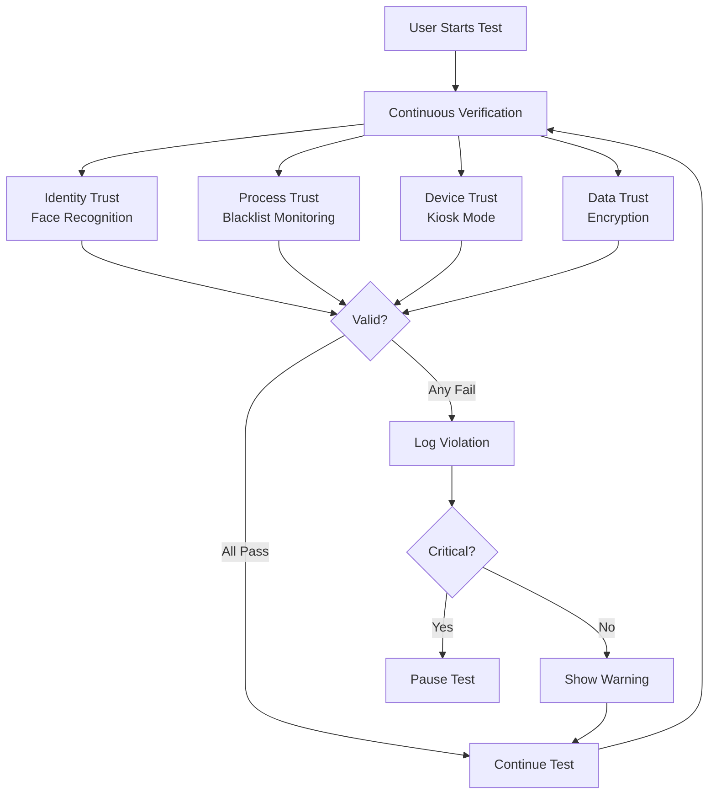
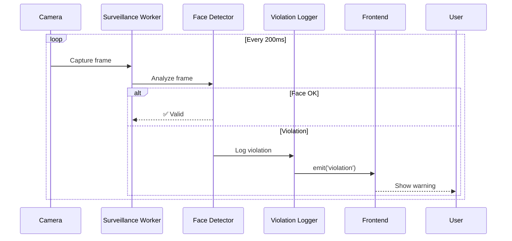

# Security Architecture - Eling Platform

> [!IMPORTANT]
> Zero Trust Architecture implementation untuk memastikan integritas test session dan mencegah cheating.

---

## 1. Zero Trust Principles



---

## 2. Identity Trust - Face Recognition

### 2.1 Baseline Capture
- **When:** Session start
- **Method:** Face embedding (512-dimensional vector)
- **Storage:** In-memory only (not persisted)

### 2.2 Continuous Monitoring
- **Frequency:** 5 FPS (every 200ms)
- **Checks:**
  - Face presence
  - Face count (must be 1)
  - Face similarity vs baseline

**Liveness Detection:**
```rust
fn detect_liveness(frames: Vec<Frame>) -> bool {
    // Check for micro-movements, blink detection
    // Prevent photo/video spoofing
}
```

---

## 3. Process Trust - Application Blacklist

**Blacklisted Applications:**
```yaml
Remote Desktop:
  - TeamViewer
  - AnyDesk
  - Chrome Remote Desktop

Browsers:
  - Chrome
  - Firefox
  - Edge
  - Safari

Communication:
  - Discord
  - Slack
  - WhatsApp Desktop

Screen Capture:
  - OBS Studio
  - Snagit
  - Lightshot
```

**Detection Method:**
```rust
// Periodic process scanning (every 5s)
fn scan_processes() -> Vec<String> {
    let forbidden = get_process_list()
        .filter(|p| BLACKLIST.contains(&p.name))
        .collect();
    forbidden
}
```

---

## 4. Device Trust - Kiosk Mode

### 4.1 Always-on-Top Enforcement
```rust
use tauri::Window;

window.set_always_on_top(true)?;
window.set_fullscreen(true)?;
window.set_decorations(false)?; // Remove title bar
```

### 4.2 Input Blocking
**Blocked Shortcuts:**
- `Alt+Tab` / `Cmd+Tab` - Task switcher
- `Alt+F4` / `Cmd+Q` - Close app
- `Win+D` / `F11` - Show desktop
- `PrintScreen` - Screenshots
- `Cmd+Space` - Spotlight search

**Implementation:**
```rust
use rdev::{listen, EventType, Key};

fn input_callback(event: Event) -> Option<Event> {
    match event.event_type {
        EventType::KeyPress(Key::Tab) if alt_pressed => None, // Block
        EventType::KeyPress(Key::F4) if alt_pressed => None,
        _ => Some(event), // Allow
    }
}
```

---

## 5. Data Trust - Encryption

### 5.1 AES-256-GCM Encryption

```rust
use aes_gcm::{Aes256Gcm, Key, Nonce};
use aes_gcm::aead::{Aead, KeyInit};

fn encrypt_response(data: &str, key: &[u8; 32]) -> (Vec<u8>, Vec<u8>) {
    let cipher = Aes256Gcm::new(Key::<Aes256Gcm>::from_slice(key));
    let nonce = Nonce::from_slice(&random_nonce());
    
    let ciphertext = cipher.encrypt(nonce, data.as_bytes()).unwrap();
    (ciphertext, nonce.to_vec())
}
```

### 5.2 Key Management

**Session Key Generation:**
```rust
use rand::Rng;

struct SessionKey([u8; 32]);

impl SessionKey {
    fn generate() -> Self {
        let mut key = [0u8; 32];
        rand::thread_rng().fill(&mut key);
        SessionKey(key)
    }
}

impl Drop for SessionKey {
    fn drop(&mut self) {
        use zeroize::Zeroize;
        self.0.zeroize(); // Overwrite memory on drop
    }
}
```

**Key Lifecycle:**
- **Generation:** At session start
- **Usage:** Encrypt all responses
- **Rotation:** Optional per subtest
- **Destruction:** Session end (auto-zeroed)
- **Storage:** Never persisted to disk

---

## 6. Network Trust - Offline-First

**Strategy:** Complete offline operation

**Benefits:**
- ✅ No data exfiltration via network
- ✅ No dependency on internet connectivity
- ✅ Privacy guaranteed (data never leaves device)

**Implementation:**
```rust
// Explicitly disable network access
#[cfg(not(debug_assertions))]
fn block_network() {
    // Use OS firewall rules to block app network access
}
```

---

## 7. Surveillance System Architecture



**Thread Safety:**
```rust
use tokio::sync::mpsc;

async fn surveillance_worker(tx: mpsc::Sender<ViolationEvent>) {
    let camera = Camera::new().await?;
    
    loop {
        let frame = camera.capture().await?;
        let result = detect_face(&frame).await;
        
        if let Err(violation) = result {
            tx.send(violation).await?;
        }
        
        tokio::time::sleep(Duration::from_millis(200)).await;
    }
}
```

---

## 8. Attack Vectors & Mitigations

| Attack Vector | Mitigation | Detection | Response |
|---------------|------------|-----------|----------|
| **Photo Spoofing** | Liveness detection | Blink analysis | Pause test |
| **Multiple People** | Face count check | OpenCV detection | Warning → Pause |
| **Face Swap** | Embedding similarity | Baseline compare | Terminate test |
| **Screen Sharing** | Process blacklist | Process scan | Pause test |
| **Virtual Machine** | Hardware detection | CPU flags check | Disable test |
| **Memory Dump** | Ephemeral keys | Key rotation | N/A (prevention) |
| **OS Shortcuts** | Input hooks | `rdev` capture | Block + log |
| **Screenshot** | Window protection | OS API | Block |

---

## 9. Violation Severity Levels

```yaml
INFO:
  - First-time warnings
  - Minor interruptions
  - Action: Log only
  
WARNING:
  - Brief face absence (<3s)
  - Blocked shortcut attempts
  - Action: Toast notification
  
CRITICAL:
  - Face absence >5s
  - Multiple faces detected
  - Blacklisted process running
  - Face mismatch
  - Action: Pause test, require manual resume
```

**Escalation Policy:**
```
3 INFO → 1 WARNING
3 WARNING → 1 CRITICAL
2 CRITICAL → Test Termination
```

---

## 10. Audit Trail

**Logged Events:**
- Session start/end
- All violations with screenshots
- Process detection events
- Face verification checkpoints
- Input blocking events

**Log Retention:**
- **Duration:** Session lifetime + 7 days
- **Storage:** Encrypted in SQLite
- **Export:** Available for review

---

## 11. Compliance & Privacy

### GDPR/PDPA Compliance:
- ✅ **Minimization:** Hanya collect data yang diperlukan
- ✅ **Encryption:** Semua PII encrypted
- ✅ **Consent:** Explicit user consent sebelum start
- ✅ **Right to Delete:** Data dihapus setelah test
- ✅ **No Transfer:** Data tidak keluar dari device

### Biometric Data Handling:
- Face embeddings **TIDAK** disimpan
- Used only for realtime comparison
- Zeroed dari memory setelah session

---

## 12. Security Testing Checklist

```markdown
[ ] Bypass shortcut attempts (all major OS shortcuts)
[ ] Photo spoofing attack
[ ] Video playback attack
[ ] Multiple face scenarios
[ ] Process blacklist effectiveness
[ ] Memory forensics (key extraction attempt)
[ ] Always-on-top enforcement
[ ] Fullscreen escape attempts
[ ] Database encryption verification
[ ] Key zeroing validation
[ ] Multi-monitor behavior
[ ] Virtual machine detection
```

---

## Summary: Security Layers

```
┌─────────────────────────────────────┐
│  Layer 5: Audit & Compliance        │
├─────────────────────────────────────┤
│  Layer 4: Data Encryption           │
├─────────────────────────────────────┤
│  Layer 3: Kiosk Mode Enforcement    │
├─────────────────────────────────────┤
│  Layer 2: Process Monitoring        │
├─────────────────────────────────────┤
│  Layer 1: Identity Verification     │
└─────────────────────────────────────┘
```

> [!CAUTION]
> Security adalah ongoing process. Regular penetration testing dan security audits wajib dilakukan setiap 6 bulan.
