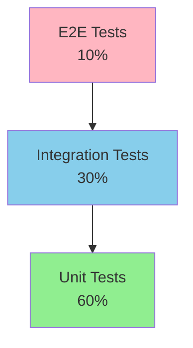

# Testing Strategy - Eling Platform

> [!NOTE]
> Comprehensive testing approach covering unit, integration, E2E, security, and performance testing.

---

## 1. Testing Pyramid



**Target Coverage:**
- Unit Tests: 60% of total tests, >80% code coverage
- Integration Tests: 30% of total tests
- E2E Tests: 10% of total tests

---

## 2. Unit Testing

### 2.1 Backend (Rust)

**Framework:** `cargo test` + `tokio::test`

**Coverage Tool:** `cargo-tarpaulin`

```rust
// Example: Test database repository
#[tokio::test]
async fn test_create_session() {
    let pool = create_test_pool().await;
    let repo = SessionRepository::new(pool);
    
    let session = repo.create(1, "TEST123").await.unwrap();
    assert_eq!(session.participant_id, "TEST123");
    assert_eq!(session.status, SessionStatus::Pending);
}

#[tokio::test]
async fn test_encrypt_decrypt_response() {
    let key = SessionKey::generate();
    let service = EncryptionService::new(key);
    
    let original = r#"{"answer": "B"}"#;
    let (encrypted, nonce) = service.encrypt(original);
    let decrypted = service.decrypt(&encrypted, &nonce);
    
    assert_eq!(original, decrypted);
}
```

**Test Coverage Target:**
- Core logic: >90%
- Repository layer: >85%
- Command handlers: >80%
- Utilities: >75%

---

### 2.2 Frontend (Vue 3)

**Framework:** `Vitest` + `@vue/test-utils`

```typescript
// Example: Test Pinia store
import { setActivePinia, createPinia } from 'pinia'
import { useTestStore } from '@/stores/test'

describe('Test Store', () => {
  beforeEach(() => {
    setActivePinia(createPinia())
  })

  it('starts session correctly', async () => {
    const store = useTestStore()
    await store.startSession(1)
    
    expect(store.currentSession).toBeDefined()
    expect(store.sessionStatus).toBe('active')
  })
  
  it('tracks violations', () => {
    const store = useTestStore()
    store.addViolation({ type: 'no_face', severity: 'warning' })
    
    expect(store.violations).toHaveLength(1)
    expect(store.canProceed).toBe(true)
  })
})
```

**Component Testing:**
```typescript
// Example: Test ChoiceEngine component
import { mount } from '@vue/test-utils'
import ChoiceEngine from '@/components/engines/ChoiceEngine.vue'

describe('ChoiceEngine', () => {
  it('renders questions correctly', () => {
    const wrapper = mount(ChoiceEngine, {
      props: {
        questions: mockQuestions,
        config: mockConfig
      }
    })
    
    expect(wrapper.findAll('.question-item')).toHaveLength(5)
  })
  
  it('submits answers', async () => {
    const wrapper = mount(ChoiceEngine, { props: {...} })
    await wrapper.find('input[value="B"]').trigger('click')
    
    expect(wrapper.emitted('answer-submitted')).toBeTruthy()
  })
})
```

---

## 3. Integration Testing

### 3.1 API Integration Tests

**Test Tauri Commands:**

```rust
#[tokio::test]
async fn test_complete_session_flow() {
    let app_state = create_test_app_state().await;
    
    // 1. Create session
    let session_resp = create_session(
        1, 
        "TEST123".to_string(), 
        None,
        State(&app_state)
    ).await.unwrap();
    
    let session_id = session_resp.session_id;
    
    // 2. Load package
    let package = load_test_package(
        session_id,
        1,
        State(&app_state)
    ).await.unwrap();
    
    assert!(!package.subtests.is_empty());
    
    // 3. Start subtest
    let subtest = start_subtest(
        session_id,
        package.subtests[0].id,
        State(&app_state)
    ).await.unwrap();
    
    // 4. Submit responses
    let responses = vec![
        ResponseData { question_id: 1, answer: "B".to_string(), time_spent: Some(10.0) }
    ];
    
    submit_responses(
        session_id,
        package.tool_id,
        package.subtests[0].id,
        responses,
        State(&app_state)
    ).await.unwrap();
    
    // 5. Complete session
    let complete = complete_session(
        session_id,
        State(&app_state)
    ).await.unwrap();
    
    assert_eq!(complete.status, "completed");
}
```

---

### 3.2 Database Integration Tests

```rust
#[tokio::test]
async fn test_encrypted_response_roundtrip() {
    let pool = create_test_pool().await;
    let session_id = create_test_session(&pool).await;
    
    // Encrypt and save
    let data = r#"{"answers": [{"q": 1, "a": "B"}]}"#;
    let key = SessionKey::generate();
    let (encrypted, nonce) = encrypt_data(data, &key);
    
    save_response(&pool, session_id, 1, 1, encrypted, nonce).await.unwrap();
    
    // Retrieve and decrypt
    let (retrieved_enc, retrieved_nonce) = get_response(&pool, session_id, 1, 1).await.unwrap();
    let decrypted = decrypt_data(&retrieved_enc, &retrieved_nonce, &key);
    
    assert_eq!(data, decrypted);
}
```

---

## 4. End-to-End Testing

### 4.1 Browser Automation (WebDriver)

**Tool:** `webdriverio` or Tauri's built-in testing

```typescript
// Example E2E test
describe('Complete Test Session', () => {
  it('should complete full test flow', async () => {
    // 1. Launch app
    await app.start()
    
    // 2. Grant camera permission (mock)
    await app.mockCameraPermission(true)
    
    // 3. Start session
    await app.click('#start-test-btn')
    await app.waitForText('Event: Rekrutmen Manager')
    
    // 4. Face verification
    await app.mockFaceDetection({ detected: true, confidence: 0.95 })
    await app.click('#verify-face-btn')
    
    // 5. Read instructions
    await app.waitForText('Instruksi')
    await app.click('#begin-subtest-btn')
    
    // 6. Answer questions
    await app.click('[data-question="1"] input[value="B"]')
    await app.click('[data-question="2"] input[value="A"]')
    
    // 7. Submit
    await app.click('#submit-answers-btn')
    
    // 8. Complete session
    await app.waitForText('Test Selesai')
    
    expect(await app.getText('#completion-status')).toBe('Completed')
  })
})
```

---

### 4.2 Security E2E Tests

```typescript
describe('Security Features', () => {
  it('blocks OS shortcuts', async () => {
    await app.start()
    await app.startTest()
    
    // Try to switch apps (should be blocked)
    await app.keyboard.press(['Alt', 'Tab'])
    
    // Verify still in app
    expect(await app.isVisible('#test-interface')).toBe(true)
    
    // Check violation logged
    const violations = await app.invoke('get_violation_summary', { sessionId: 1 })
    expect(violations.totalCount).toBeGreaterThan(0)
  })
  
  it('detects face absence', async () => {
    await app.startTest()
    
    // Mock no face detected
    await app.mockFaceDetection({ detected: false })
    
    // Wait for violation
    await app.waitForText('Wajah tidak terdeteksi')
    
    const violations = await app.invoke('get_violation_summary', { sessionId: 1 })
    expect(violations.violations.some(v => v.type === 'no_face')).toBe(true)
  })
})
```

---

## 5. Performance Testing

### 5.1 Benchmark Tests (Rust)

**Tool:** `criterion`

```rust
use criterion::{criterion_group, criterion_main, Criterion};

fn benchmark_input_latency(c: &mut Criterion) {
    c.bench_function("kraepelin_input", |b| {
        b.iter(|| {
            // Simulate user input
            process_input("5");
        })
    });
}

fn benchmark_face_detection(c: &mut Criterion) {
    let frame = load_test_frame();
    
    c.bench_function("face_detect_frame", |b| {
        b.iter(|| {
            detect_faces(&frame);
        })
    });
}

criterion_group!(benches, benchmark_input_latency, benchmark_face_detection);
criterion_main!(benches);
```

**Acceptance Criteria:**
- Input latency: < 16ms (60 FPS)
- Face detection: < 200ms (5 FPS)
- Database query: < 50ms (p99)
- Encryption: < 10ms per operation

---

### 5.2 Load Testing

```bash
# Stress test: 1000 rapid inputs
for i in {1..1000}; do
  echo "Input $i"
  # Simulate input
done

# Monitor:
# - Memory usage should stay < 200MB
# - No input drops
# - UI remains responsive
```

---

## 6. Security Testing

### 6.1 Penetration Testing Checklist

```markdown
**Authentication & Authorization:**
- [ ] Session hijacking attempts
- [ ] Bypassing face verification with photo
- [ ] Bypassing face verification with video
- [ ] Multiple simultaneous sessions

**Input Validation:**
- [ ] SQL injection attempts (if dynamic queries used)
- [ ] XSS attempts in text inputs
- [ ] Buffer overflow attempts
- [ ] Malformed JSON payloads

**Kiosk Mode:**
- [ ] Alt+Tab / Cmd+Tab blocking
- [ ] Alt+F4 / Cmd+Q blocking
- [ ] Minimize/Hide attempts
- [ ] Multi-monitor escape
- [ ] Virtual desktop switching

**Surveillance:**
- [ ] Photo spoofing detection
- [ ] Video loop detection
- [ ] Multiple faces detection
- [ ] Face swap detection

**Data Security:**
- [ ] Memory dump analysis (key extraction)
- [ ] Database encryption verification
- [ ] Secure key deletion verification
- [ ] Data recovery after deletion

**Process Monitoring:**
- [ ] Blacklisted app detection
- [ ] Screen recorder detection
- [ ] Remote desktop detection
- [ ] VM detection
```

---

### 6.2 Automated Security Scans

```bash
# SAST (Static Analysis)
cargo clippy -- -D warnings
cargo audit --deny warnings
semgrep --config=auto .

# Dependency vulnerabilities
cargo deny check advisories

# Container scanning (if using Docker)
trivy image eling-builder:latest

# Secret detection
gitleaks detect --source . --verbose
```

---

## 7. Regression Testing

### 7.1 Continuous Testing

**Pre-commit Hook:**
```bash
#!/bin/bash
# .git/hooks/pre-commit

# Run fast tests
cargo test --lib
npm run test:unit

# Lint
cargo clippy -- -D warnings
npm run lint
```

**CI Pipeline:**
```yaml
# .github/workflows/test.yml
on: [push, pull_request]

jobs:
  test:
    strategy:
      matrix:
        os: [ubuntu-latest, windows-latest, macos-latest]
    runs-on: ${{ matrix.os }}
    
    steps:
      - uses: actions/checkout@v3
      - name: Run tests
        run: |
          cargo test --all-features
          npm run test
      - name: Coverage
        run: cargo tarpaulin --out Xml
      - name: Upload coverage
        uses: codecov/codecov-action@v3
```

---

## 8. Test Data Management

### 8.1 Test Fixtures

```rust
// tests/fixtures/mod.rs
pub fn mock_questions() -> Vec<Question> {
    vec![
        Question {
            id: 1,
            question_text: "Test question 1".to_string(),
            question_type: QuestionType::MultipleChoice,
            options: Some(vec!["A", "B", "C", "D"]),
            sequence_order: 1,
        },
        // ...
    ]
}

pub fn mock_session() -> Session {
    Session {
        id: 1,
        event_id: 1,
        participant_id: "TEST123".to_string(),
        status: SessionStatus::Active,
        started_at: Some(Utc::now()),
        completed_at: None,
        metadata: None,
    }
}
```

---

### 8.2 Database Seeding for Tests

```sql
-- tests/fixtures/test_data.sql
INSERT INTO tools (id, name, tool_type, category) VALUES
(1, 'TEST_TOOL', 'choice', 'cognitive');

INSERT INTO events (id, event_name, status) VALUES
(1, 'TEST_EVENT', 'active');

INSERT INTO packages (id, tool_id, package_name, version, content_data) VALUES
(1, 1, 'TEST_PACKAGE', '1.0', '{}');
```

---

## 9. Test Reporting

### 9.1 Coverage Report

```bash
# Generate HTML coverage report
cargo tarpaulin --out Html --output-dir ./coverage

# Open in browser
open coverage/index.html
```

**Target Metrics:**
- Overall coverage: >80%
- Critical paths: >95%
- New code: >90%

---

### 9.2 Test Results Dashboard

```yaml
# test-results.yml (artifact)
total_tests: 1247
passed: 1245
failed: 2
skipped: 0
coverage: 84.3%
duration: 3m 42s

failed_tests:
  - name: "test_camera_permission_denied"
    error: "Permission denied"
  - name: "test_face_detection_timeout"
    error: "Timeout after 5s"
```

---

## 10. Testing Timeline

### Week-by-Week

**Week 1-6 (Development):**
- Write unit tests alongside code (TDD approach)
- Target: >75% coverage by week 6

**Week 7-9 (Security Implementation):**
- Security unit tests
- Integration tests for security features
- Manual penetration testing

**Week 10-12 (Content):**
- Scoring algorithm tests
- Data integrity tests
- Report generation tests

**Week 13 (QA Week):**
- E2E test suite execution
- Performance benchmarking
- Security audit
- Bug bash session

**Week 14 (Release):**
- Regression testing
- Smoke tests
- UAT with real users
- Final security scan

---

## 11. Acceptance Criteria

### Definition of Done (DoD)

**For each feature:**
- [ ] Unit tests written (>80% coverage)
- [ ] Integration tests passed
- [ ] Code review completed
- [ ] Documentation updated
- [ ] No critical bugs
- [ ] Performance benchmarks met

**For release:**
- [ ] All tests passing (100%)
- [ ] Coverage >80%
- [ ] Security scan: 0 CRITICAL, 0 HIGH
- [ ] Performance targets met
- [ ] E2E scenarios passed
- [ ] UAT approved

---

## Summary

**Testing Approach:**
- Test-Driven Development (TDD) untuk core logic
- Continuous testing dalam CI/CD
- Automated regression testing
- Regular security audits
- Performance monitoring

**Key Metrics:**
- Code coverage: >80%
- Test pass rate: 100%
- Security vulnerabilities: 0 CRITICAL
- Performance: All benchmarks met

> [!TIP]
> Write tests first (TDD), automate everything, test continuously, and never skip security testing!
